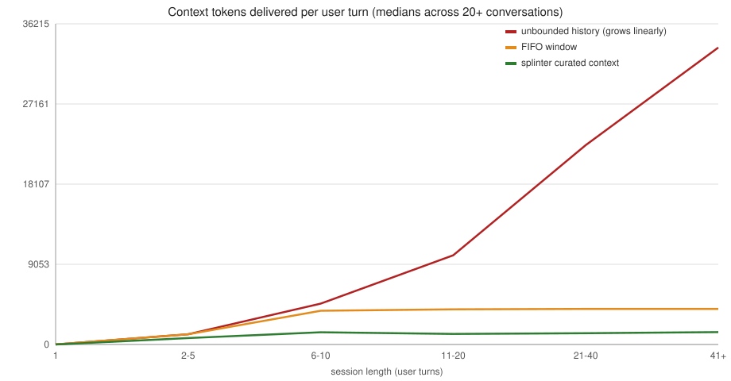

# Strata-Memory

[](https://github.com/sky-is-green/strata-memory/actions/workflows/ci.yml)

[](https://github.com/sky-is-green/Strata-memory/blob/StrataMemory-test/LICENSE)
[](https://github.com/sky-is-green/Strata-memory)
[](https://github.com/sky-is-green/Strata-memory)
[](https://github.com/sky-is-green/Strata-memory)
[](https://github.com/sky-is-green/Strata-memory)
[](https://github.com/sky-is-green/Strata-memory)
[](https://github.com/sky-is-green/Strata-memory)
[](https://github.com/sky-is-green/Strata-memory/commits/StrataMemory-test)
[](https://github.com/sky-is-green/Strata-memory)

**Strata-Memory** is an external, multi-agent context-curation layer for
long-horizon LLM conversations. It sits between a user and a local LLM backend,
filtering, scoring, compressing, and reassembling conversation history into a
bounded, high-relevance context window for every turn, so a generative model
performs well over arbitrarily long conversations on consumer hardware.

**HiveBench**, its evaluation suite and Studio sidecar, lives in the dedicated [hivebench](https://github.com/sky-is-green/hivebench) repo:
the white paper's falsifiable predictions
([P1-P11](STRATA-WHITE-PAPER.md#5-hypotheses-and-predictions)) as executable tests with
measured verdicts, an offline test suite, and the live benchmark harness.

## Quickstart

Requires Python 3.10+ and, for live runs, any OpenAI-compatible backend (LM Studio on `localhost:1234`), or nothing at all: the studio can manage a local
`llama-server` for you from GGUF files dropped into `models/gguf/`.

```powershell
git clone https://github.com/sky-is-green/strata-memory.git
cd strata-memory
python -m venv .venv
.\.venv\Scripts\python -m pip install -e .   # the system: drones, cortex, retention, backends
```

Linux/macOS: same in each checkout — `python3 -m venv .venv && .venv/bin/python -m pip install -e .`
The Studio sidecar and the evaluation suite live in the sibling [hivebench](https://github.com/sky-is-green/hivebench) repo — its README covers install, `--setup`, suite runs, and live benchmarks.

The full fresh-machine walkthrough (fixtures, live benchmark, troubleshooting)
is `docs/INSTALL.md`; every claim below is reproduced by commands in these two checkouts.

## Why Strata

The core idea is the white paper's *Separation Postulate*: small bidirectional
"drone" encoders (fast, cheap, CPU-friendly) do the *comprehension*, scoring,
filtering, and routing context, while the primary generative LLM does the
*generation*.

**The headline measurement**: same 308+ turn conversations, same model,
strata vs naive FIFO windowing (live run `20260822_211131`):

- **[Strata ≥ FIFO on 85.1% of retrievable turns](STRATA-WHITE-PAPER.md#p3-context-sufficiency-hypothesis) (P3)**;
  the direct head-to-head against the current standard
- **[90.3% of the facts the model stated made it into context](STRATA-WHITE-PAPER.md#p2-retrieval-precision-hypothesis)** (P2), deterministic
  diagnostic, ≥90% target; FIFO truncates and drops facts at its window
  limit
- **[Flat generation speed across 308+ turns](STRATA-WHITE-PAPER.md#p1-constant-throughput-hypothesis)** (P1), 14.5 → 15.5 decode tps
  (+6.7%), no context-bloat slowdown
- All at ~3.4 ms assembly + ~15 ms drone scoring overhead per turn


*PES is the system's own pipeline-efficiency score (retrieval/routing/
latency/throughput/utilization), a health signal, not a measure of answer
quality. The head-to-head evidence above is what the claims rest on.*

**Why Strata is a great addition to LLM use**

- **Bounded cost, always.** The strata caps the context window regardless of
  conversation length (adaptive budget: 1-3k tokens live), so per-turn cost and
  generation time stay flat instead of growing with history. And because KV
  compression is a *precision* axis while curation is a *selection* axis, the
  savings compound rather than compete: paired with a TurboQuant-class KV
  quantizer (~3-4 bits, near-zero loss), a strata-curated context makes a
  50k-token conversation's cache ~150× smaller than raw history, selection
  multiplies precision on the surviving tokens (white paper §1.6).
- **It drops in around your existing backend.** Any OpenAI-compatible endpoint
  (LM Studio, llama.cpp, vLLM, hosted APIs) works, no model retraining, no
  prompt rewrites; the harness exposes it as a drop-in API.
- **Runs on consumer hardware.** The drones are small CPU models (~60 MB,
  ~5 ms/query, no GPU required), verified on an AMD-only rig with no NVIDIA,
  where FP8-attention paths don't exist (the exact gap TurboQuant-class KV
  quantization fills).
- **The efficiency gap is measured, not claimed:**

| Metric | Strata | Status quo (FIFO/rolling window) |
|---|---|---|
| Pipeline efficiency (PES, flagship live run) | **80.0 GREEN** | 12.2 / 11.6 |
| [Decode speed over 308+ turns](STRATA-WHITE-PAPER.md#p1-constant-throughput-hypothesis) (P1) | **Flat** (14.5→15.5 tps, +6.7%) | Slows as context grows, then truncates |
| [Stated-fact recall](STRATA-WHITE-PAPER.md#p2-retrieval-precision-hypothesis) (P2, deterministic) | **90.3%** | Facts dropped at window limit |
| [Turns where strata ≥ FIFO](STRATA-WHITE-PAPER.md#p3-context-sufficiency-hypothesis) (P3) | **85.1%** | - |
| Paired A/B under window pressure (82 turns, live) | **84.1% overall; 87.5% vs 82.1% late-turn, once the window drops facts** | 84.1% while its window still holds everything |
| Context utilization (p50) | **74.5%** | ~40% (fluff) |
| Added latency per turn | **~18 ms** | 0 (but loses the facts) |
| Stability (500-turn run) | **0 OOM**, peak RSS 34.7 MB | - |

All numbers are the live runs recorded in the white paper's measured-outcome
table (§8); PES is defined in §6. The paired A/B row is the fair-selection
live measurement (bonsai-27b, identical replayed history for both arms,
FIFO window capped at 1500 tokens to force truncation): at parity overall,
with strict strata-only wins outnumbering FIFO-only 14:6 once the naive
window starts dropping facts.



*Median context tokens per user turn across 721 live turns (two run bundles):
the strata delivers a flat ~1.2-1.4k-token window regardless of session length,
while the unbounded history it replaces reaches 33,500+ tokens by turn 40.*

## Why HiveBench

Most evaluation harnesses tell you how a model performs in a sandbox. The
hivebench suite — its own repo, checked out alongside this one — tells you *whether the context you feed the
model is the reason it works*, deterministically, offline, and replayably: falsifiable P1-P11 predictions with
measured PASS/FAIL verdicts (including its own failures), a ~30 s offline suite, paired A/B head-to-heads against
the naive FIFO window, and an auditor that corroborates the evidence without constituting it. Rationale, run
commands, and the live-benchmark guide are in the hivebench README.

## FAQ

Objections we actually hear, answered with what ships in this repo.

**Does my data leave my machine?**
Not by default, and the default is the product: conversations are curated by
CPU-resident drones against a backend you host (LM Studio / llama.cpp on
localhost; the studio can manage a local `llama-server` for you), stores and
archives live in local files, and the studio binds `127.0.0.1`. Nothing phones
home. Hosted APIs only come into play if you put keys in
`providers.local.json` (gitignored) yourself, and then only the requests you
point at that provider leave.

**How is this different from mem0 / Letta / Hindsight?**
They are agent-memory frameworks: append experience, retrieve it later, inside
their own runtime. HiveMemory overlaps on the goal (long-horizon context that
stays useful) but differs on three things. It is *evaluation-first*: the
HiveBench protocol publishes falsifiable predictions with measured PASS/FAIL
verdicts, including its own failed ones, instead of demo numbers. Its curation
is a *bounded* relevance-ranked window under decay, dedup, and drift policies,
so per-turn cost stays flat while unbounded memory grows. And it sits in front
of any OpenAI-compatible backend as a drop-in layer or endpoint, no SDK lock-in
and no model changes. Use them when you want managed memory features inside
their runtimes; use this when you want bounded cost and claims you can re-run.

**Why not just use a bigger context window?**
Because window size is not usable-context size: models under-use mid-window
content (lost-in-the-middle), every turn pays for the whole history, and at
the limit a rolling window blindly evicts exactly the early facts long
conversations need (white paper §1.1). A bigger window moves the cliff; the
strata removes the growth, feeding a flat 1-3k curated window at constant decode
speed (P1) while stated-fact recall measures 90.3% (P2).

**Is this just RAG?**
RAG retrieves from an external corpus per query. The strata retrieves from *the
conversation itself*, continuously, through decay/dedup/drift retention
policies, and composes with RAG rather than competing with it (white paper §2).

## Repo layout

| Path | Contents |
|---|---|
| `strata/` | The system: cortex (routing, PES, congestion, e2e), sieve (drones), retention (**hygiene**, store, decay, comb, remembrance), focal (budget/assembly), membrane (dedup/drift), backend (LM Studio / OpenAI-compat / vLLM), auditor (async ground truth), mcp (server + tools) |
| sibling `../hivebench` | The evaluation suite + Studio sidecar — its own repository ([sky-is-green/hivebench](https://github.com/sky-is-green/hivebench)): `tests/`, `testing/`, `experiments/`, `harness/`, fixtures |
| `docs/` | Install guide + integration guides (`INTEGRATE.md`: drop-in endpoint, Studio, DSH plugin, MCP) |

## What we have now

The pipeline per user turn — **Membrane → Retention → Sieve → Focal** — plus
the services around it:

| Layer | Module | Role |
|---|---|---|
| Membrane | `strata/membrane/` | Semantic dedup + topic-drift detection, before scoring |
| Retention | `strata/retention/` | Chunk store with decay state, remembrance ladder, comb surplus tier (SSD archive) |
| Sieve | `strata/sieve/` | Small CPU "drone" encoders score every candidate (~5 ms/query, no GPU) |
| Focal | `strata/focal/` | Adaptive budget, relevance floor + per-chunk share cap (P1-FLOOR), assembly into a bounded window |
| Cortex | `strata/cortex/` | Routing, congestion control, PES health, checkpoint/resume, e2e engine |
| Auditor | `strata/auditor/` | Asynchronous ground truth: labels whether the assembled context was sufficient, after each turn (historical name: 'queen') |
| MCP | `strata/mcp/` | `strata_search` / `strata_remember` tools on the sidecar; any MCP client (Studio, opencode, DSH) queries the same curated store |

**Write-side hygiene is one pipeline.** Every chunk passes through
`retention/hygiene.py` before fingerprinting: harness boilerplate stripped
(P0) → secrets and base64 blobs redacted, length capped (U2) → 12-hex content
fingerprint. Dedup groups the sanitized form, so every downstream tier —
active store, checkpoints, comb archives — inherits clean data. The same
composite entry point (`prepare_for_storage`) is used by the store's write
path and by the sidecar's payload-echo guard; that shared normalization is
what makes recency-echo dedup compare like-for-like (RC2).

**The sidecar** (the `harness/` package in the sibling hivebench repo) exposes the system as a drop-in
OpenAI-compatible endpoint with the Studio UI on `127.0.0.1:8765`; integration
modes are in `docs/INTEGRATE.md`. Sidecar lifetime is bound to Studio
(P1-LIFECYCLE): it starts when the studio starts and dies with it, zero
polling.

## How we got here

- **Launch state** — the white paper system: layered pipeline with P1–P11
  measured on live runs (flagship `20260822_211131`).
- **Integration wave (S1–S3)** — DSH Mode C plugin; MCP server on the sidecar
  (`2c2b6f4`, `aac9019`); the MCP path made a tested feature, live battery:
  recall/precision 95.4% at ~30 ms/query over 90 probes (Round 6).
- **Corruption eradication** — the suite found harness control text, secrets,
  and verbatim duplicate chunks leaking into persistent memory; fixed as a
  stack, each fix fenced by tests: P0 ingest boilerplate filter + P1 payload
  echo dedup (`2644cbd`); RC1 fingerprint guard for duplicates (`c9b2a58`,
  `621f5c2`, `2154dd5`); RC2 shared normalization so scoring and payload
  fingerprints compare like-for-like (`c9b2a58`; host-side trim `84bce97`);
  P1-FLOOR relevance floor + per-chunk window-share cap (`b5b9e66`).
- **P1-LIFECYCLE** — sidecar lifetime bound to Studio (`3bd8499`).
- **This pass (2026-09-12)** — hygiene consolidation: the boilerplate filter
  and U2 sanitizer merged into one `retention/hygiene.py` pipeline with a
  single composite entry point shared by store writes and payload echo;
  `filter.py` retired. Behavior-preserving: suite green before and after.

## Where we're going

- **Codec repair layer (next build)** — self-healing cp1252↔UTF-8 round-trip
  transform for mojibake-corrupted chunks: strict normalization hooked into
  `prepare_for_storage()` pre-fingerprint, read-boundary defense at context
  assembly, one-time scrub of existing stores. Verification plan: idempotency,
  false-positive guard on clean accented text, mojibake fixture round-trips,
  dedup groups the repaired form, legacy poisoned chunks heal on read without
  migration.
- **S4/S5** — Studio provider row → sidecar (recall battery done; provider row
  pending UI confirm); opencode provider config → sidecar with conversation id
  = project name.
- **P12** — store-time fact distillation (white paper, DRAFT, protocol only).

## Tests and evidence

| Suite | Covers | Current state |
|---|---|---|
| unit (hivebench repo) | every layer, offline, no LLM calls | 546 tests, all passing (verified Sep 12) |
| integration (hivebench repo) | pipeline end-to-end, incl. live-gated MCP suite | 53 tests |
| Live batteries | paired A/B vs FIFO, protocol P1–P11 verdicts, MCP battery | recorded in white paper §8 and per-run reports |

Run from the sibling hivebench checkout: `python -m pytest tests/unit -q`, ~25 s offline (its README has the grouped runs).

## Use the system in your own project

`strata/` is self-contained; it never imports from the bench or the harness:

```python
from strata import Strata, StrataConfig, UltraSmallDrone, LMStudioBackend

strata = Strata(
    config=StrataConfig(),
    ultra=UltraSmallDrone(),
    backend=LMStudioBackend(base_url="http://localhost:1234"),
)
result = strata.process_turn("what did we decide about auth?")
print(result.reply)
```

## Studio, test suite, and live runs

The Studio sidecar, the evaluation suite, and the live benchmark harness all
live in the [hivebench](https://github.com/sky-is-green/hivebench) repo — its README has the install, `--setup`, suite-run, and resumable live-run commands
(everything runs from that checkout).

See `docs/INSTALL.md` for the full setup and run guide, and
`STRATA-WHITE-PAPER.md` §8 for the measured-outcome table behind every claim.

## Documentation

- **`docs/INSTALL.md`**, full-stack install guide (system + benchmark + studio, fresh machine)
- **`docs/INTEGRATE.md`**, using strata-memory inside OpenCode, dsh, or your own harness
- **`STRATA-WHITE-PAPER.md`**, the theory: postulates, falsifiable predictions P1-P11 with measured verdicts (§8), the PES metric (§6), KV-compression landscape (§1.6), threats & limitations (§9)
- **`STRATA-DIAGRAMS.md`**, visuals and measured charts
