# Splinter Memory: Why SPLINTER Improves Over Not Using SPLINTER

Companion to `SPLINTER-WHITE-PAPER.md` and `SPLINTER-HANDOFF.md` (the single master doc: project state, roadmap, usage).

> **Note (2026-08-24):** the diagrams in §1-§5 are now also embedded in the
> white paper (§1.1, §1.2, §4) alongside the measured charts; this file
> remains the standalone visual summary.
This document answers one question with diagrams:

> **Why does the SPLINTER system improve results over not using SPLINTER, and why?**

> Rendering: the diagrams below are Mermaid. Open this file in GitHub, VS Code
> (with "Markdown Preview Mermaid Support"), or Obsidian to render them. If
> your viewer does not render Mermaid (especially the `xychart-beta` charts in
> §6), use the rendered images in `figures/`, they are embedded in
> `SPLINTER-WHITE-PAPER.md` and shown again under each chart below.

---

## 1. The one-sentence argument

The one-sentence argument: **naive systems keep the *most recent* text; SPLINTER keeps the
*most relevant* text.** Everything else follows from that distinction.

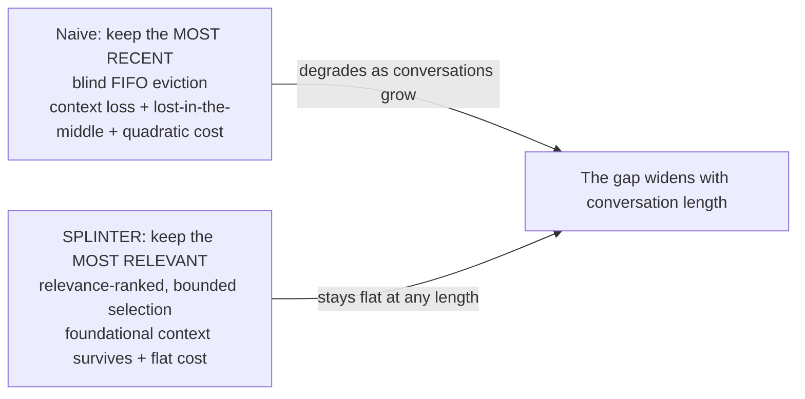

---

## 2. Why naive fails, and how SPLINTER removes each failure mode

The white paper identifies three compounding failure modes in long conversations. SPLINTER exists
because each one is **engineerable away** rather than an irreducible limit.

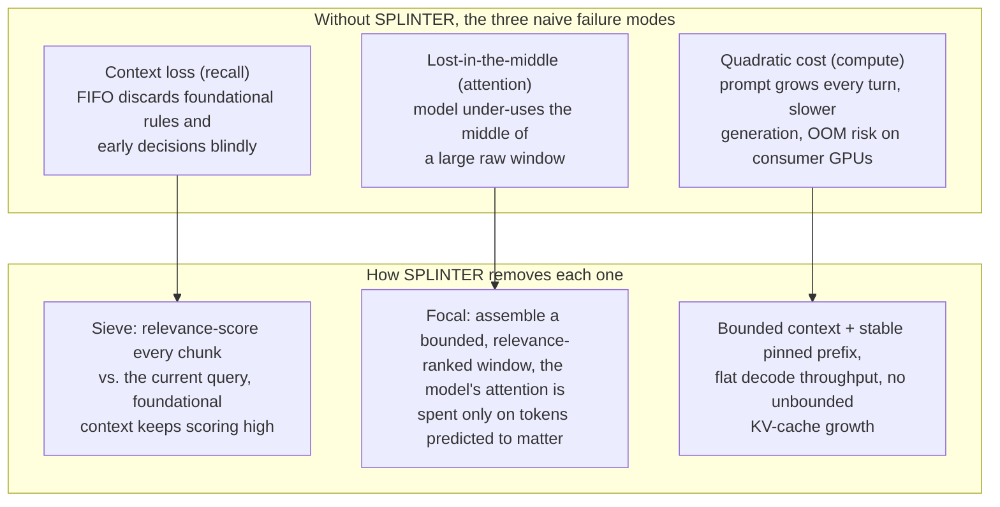

---

## 3. The comparison: same conversation, two outcomes

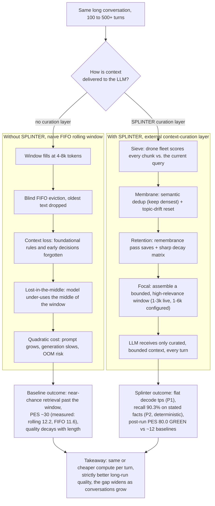

---

## 4. Why the mechanism wins: the causal chain

### 4.1 Postulates → outcomes (the logical "why")

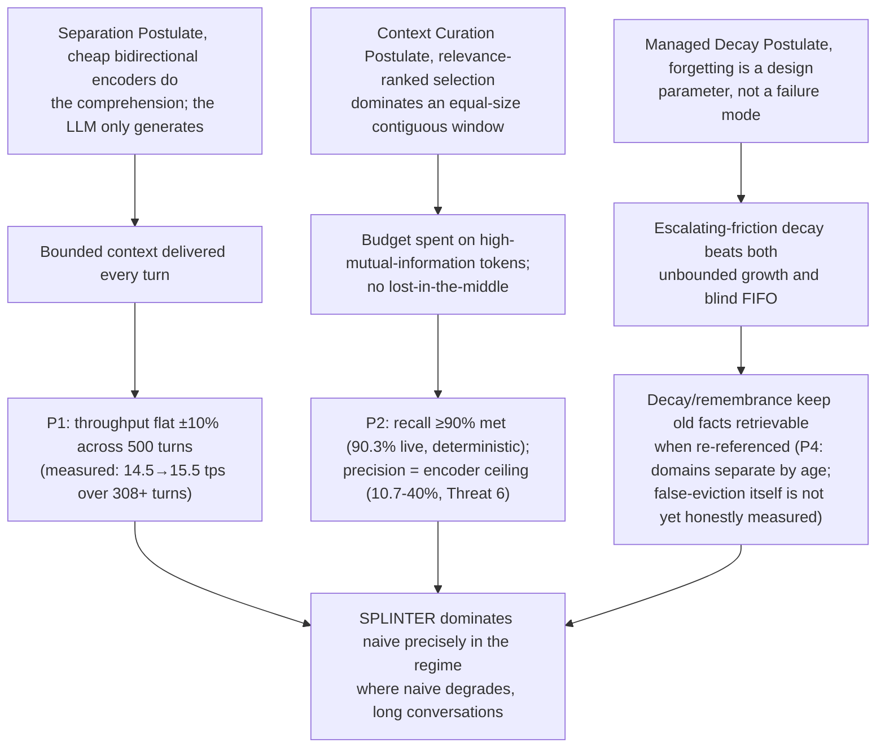

### 4.2 Why externalizing comprehension is cheaper and better

SPLINTER is not "more context", it is **better allocation of the same compute**.

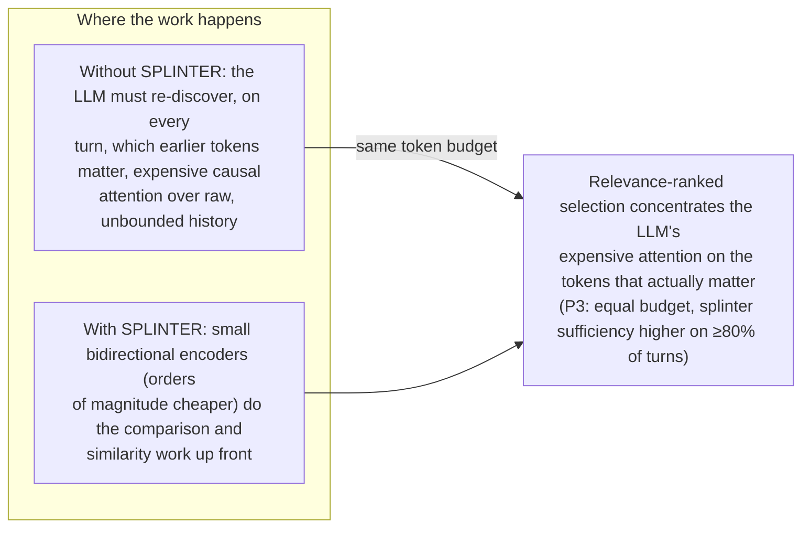

---

## 5. Why the improvement grows with conversation length

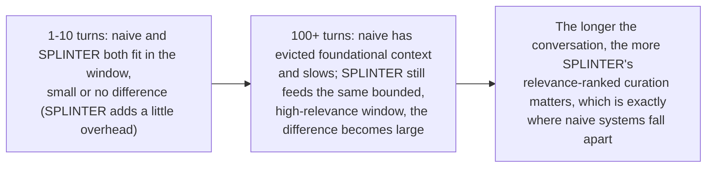

---

## 6. Measured results (2026-08-23)

The white paper's §8 table carries the numbers; here they are as charts. All
values are measured (see the paper's §5 for protocol, sources, and confound
notes).

### 6.1 P4: decay survival curves (the domain separation)

Answer-fact survival vs the initial decay multiplier, long-horizon replay
sweep (real L3-v2 drone, fixed 1000-token budget). Code facts (young, no
stale penalty) tolerate aggressive decay; prose facts (stale, age > 20) die at
the lowest multiplier: m90 1.8 vs 1.2, gap 0.6 > 0.2 band.

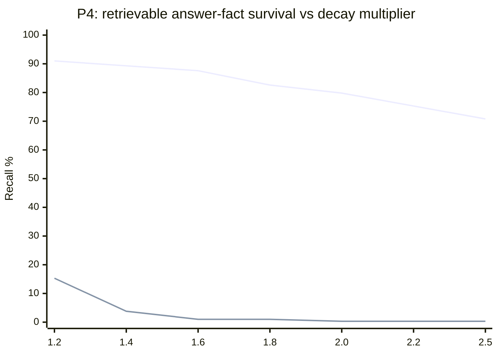

### 6.2 Threat 6: every encoder lands on the same top-K curve

Retrieval precision at top-K on the held-out same-domain pairs (264 pairs, 87
relevant): scale (bge-m3, 568M) and task tuning (contrastive) do not break the
ceiling, the curve is data-structural, not encoder-capacity.

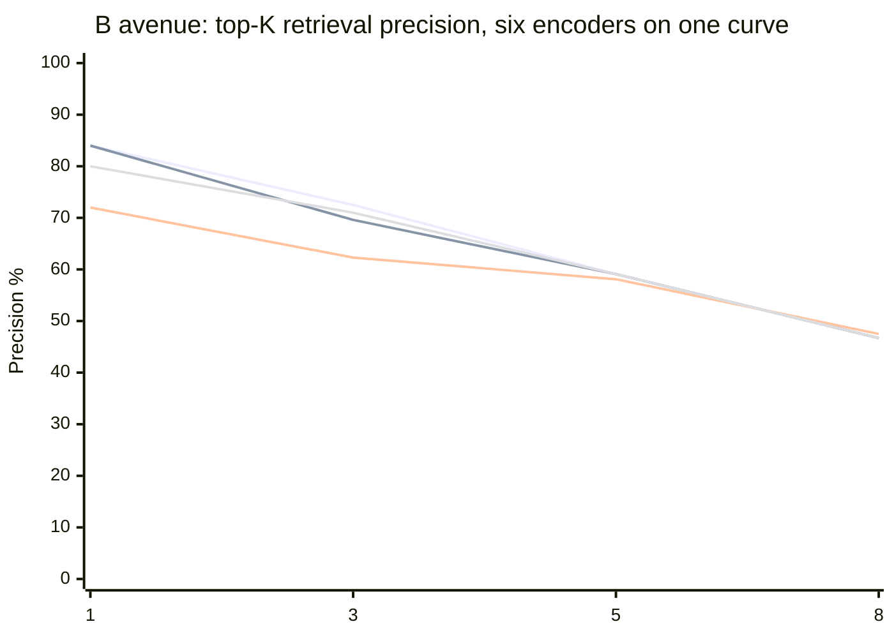

### 6.3 P9: densest retention wins the duplicate A/B

Sufficiency per 1k tokens: on the informative turns (dense-first order) the
densest-keeping dedup delivers the same fact in ~1.8× less budget; the control
(both policies keep the dense copy) shows no effect, as designed.

```mermaid
xychart-beta
    title "P9: sufficiency per 1k tokens, densest vs recency retention"
    x-axis ["informative", "control"]
    y-axis "fact-presence × 1000 / fact tokens" 0 --> 35
    bar "densest" [32.3, 30.5]
    bar "recency" [17.6, 30.5]
```

### 6.4 PES: the splinter vs the baselines (post-run, 211131)

The bounded-context headline: post-run PES 80.0 GREEN vs the no-splinter
baselines on the same conversations.

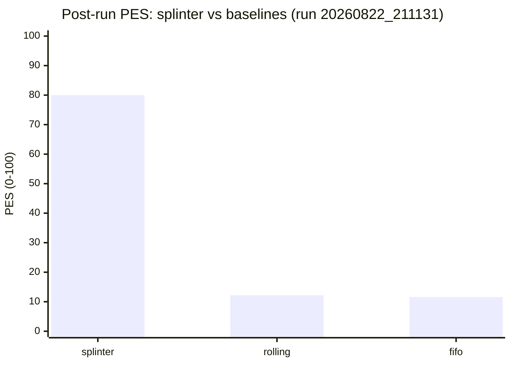

### 6.5 Budget ceiling: invariant to the model window (8k-32k)

Replay of 348 fixture turns at `max_context` 8k/16k/32k: byte-identical
budgets (p50 1400), assembled tokens (p50 ~996), utilization (66.9%). The
route-tier ranges bind; the window cap never does.

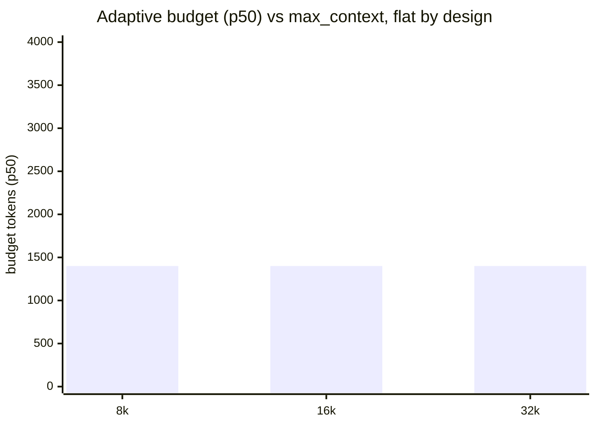

---

> **Bottom line:** SPLINTER wins because it externalizes the two things a generative model is
> bad at (*remembering* and *selecting*) to components built for them, and spends the
> model's expensive attention budget only on tokens predicted to matter. Naive systems
> degrade on all three axes (recall, attention, compute) as conversations grow; SPLINTER's
> bounded, relevance-ranked context keeps all three flat, with the honest caveat that
> selection *efficiency* (precision) is an open, documented ceiling (Threat 6) rather than
> a solved one.

