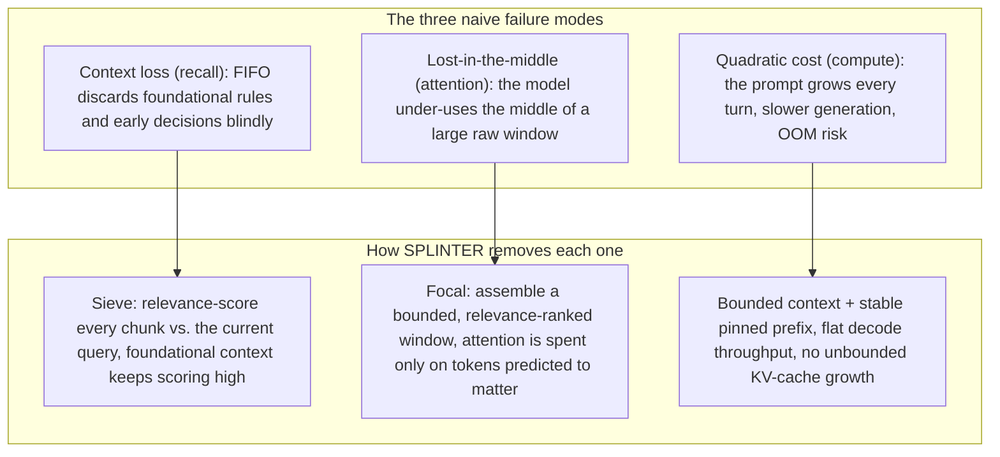
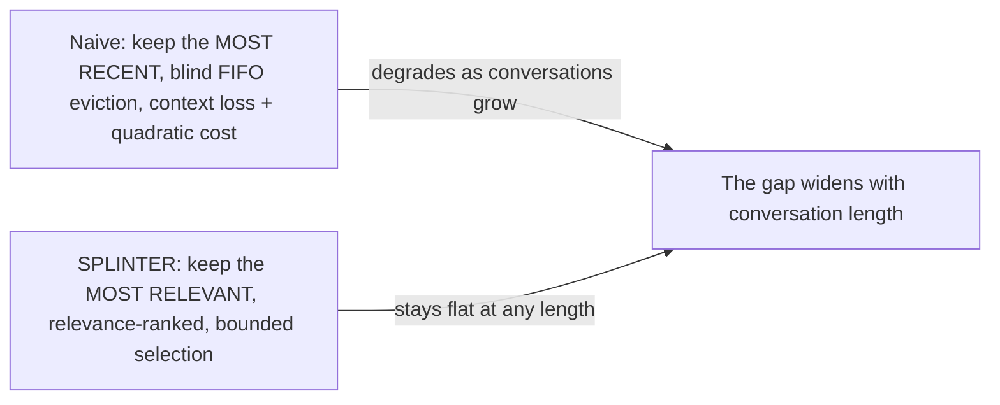
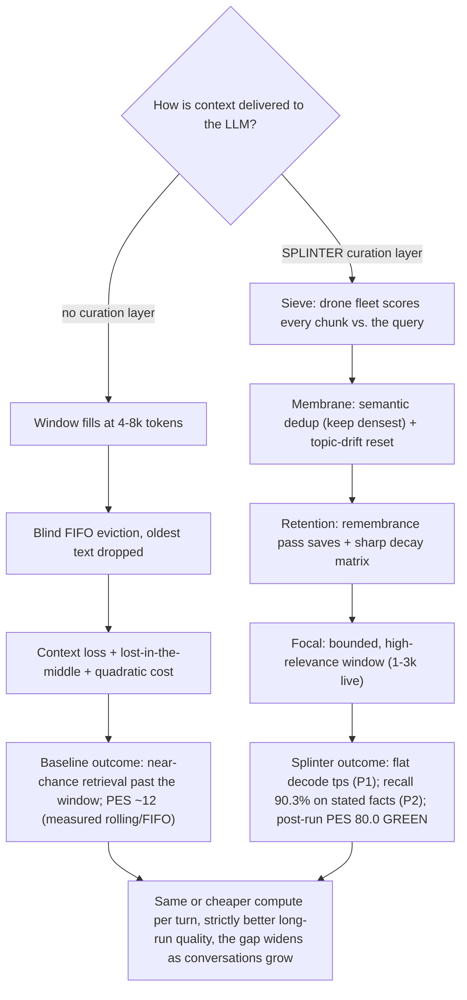
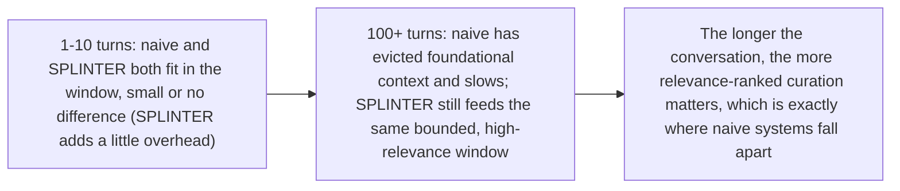
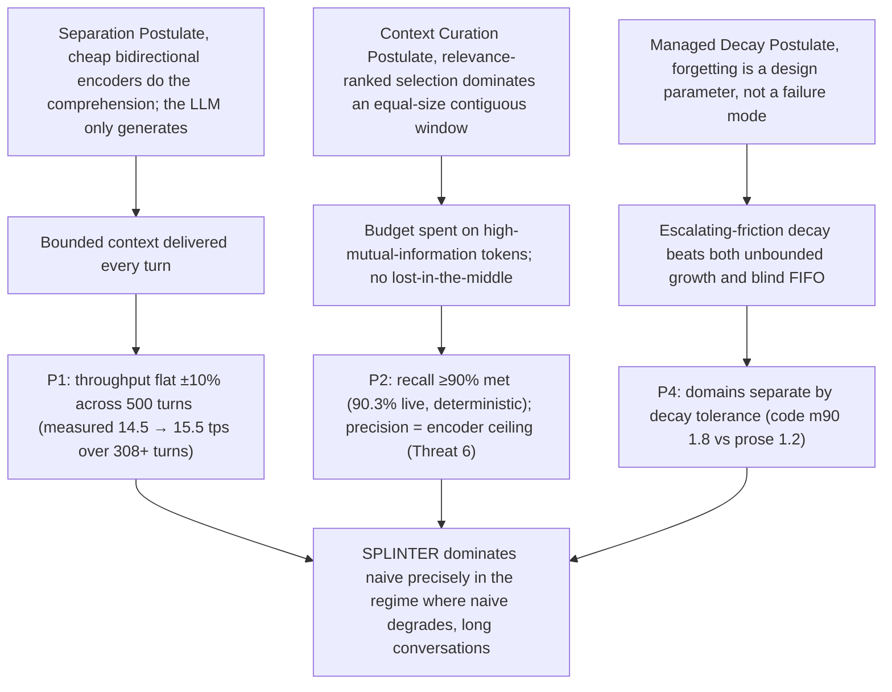
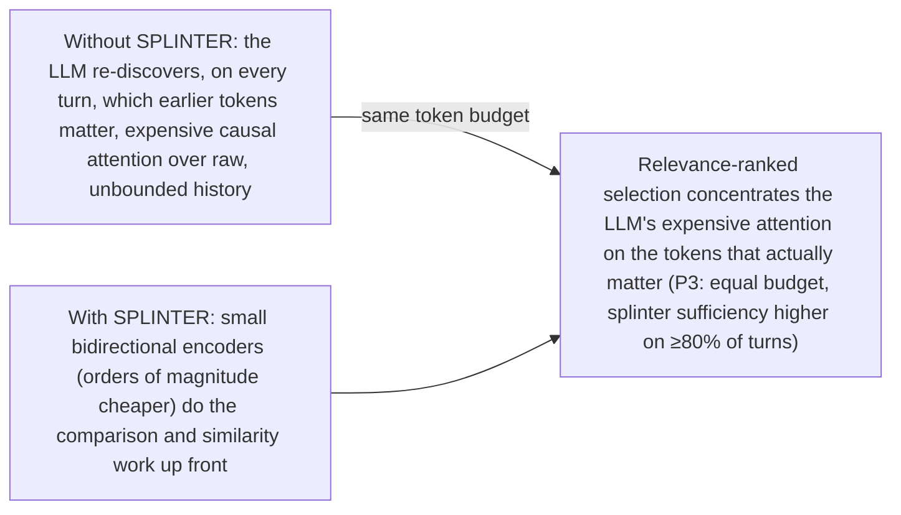

# Splinter Memory: A Managed-Decay Context Curation Architecture for Long-Horizon LLM Conversations

**A white paper for the open-source LLM and testing community**

---

## Contents

- [Abstract](#abstract)
- [1. Introduction & Motivation](#1-introduction--motivation) · [1.1 The problem](#11-the-problem) · [1.2 The proposed remedy](#12-the-proposed-remedy) · [1.3 Scope of the evaluation](#13-the-scope-of-this-evaluation) · [1.4 Measured benefit](#14-the-user-visible-benefit-measured) · [1.5 Why it must be separate](#15-why-this-component-is-needed-why-it-affects-all-llm-usage-and-why-it-must-be-separate) · [1.6 KV-compression axes](#16-relationship-to-kv-compression-the-three-axes-turboquant-and-friends)
- [2. Related Work](#2-related-work)
- [3. Architectural Overview](#3-architectural-overview)
- [4. Theoretical Foundations](#4-theoretical-foundations) · [Postulate 1: context curation](#postulate-1-the-context-curation-postulate) · [Postulate 2: managed decay](#postulate-2-the-managed-decay-postulate) · [Postulate 3: separation](#postulate-3-the-separation-postulate) · [Postulate 4: ground-truth bootstrap](#postulate-4-the-ground-truth-bootstrap-postulate)
- [5. Hypotheses and Predictions](#5-hypotheses-and-predictions) · [P1 Constant throughput](#p1-constant-throughput-hypothesis) · [P2 Retrieval precision](#p2-retrieval-precision-hypothesis) · [P3 Context sufficiency](#p3-context-sufficiency-hypothesis) · [P4 Domain-dependent decay](#p4-domain-dependent-decay-curve) · [P5 Targeted masking](#p5-targeted-masking-hypothesis) · [P6 Confidence escalation](#p6-confidence-escalation-hypothesis) · [P7 Auditor agreement](#p7-auditor-agreement-hypothesis) · [P8 Heuristic-routing floor](#p8-heuristic-routing-floor-hypothesis) · [P9 Densest duplicate](#p9-densest-duplicate-hypothesis) · [P10 Drift reset](#p10-drift-reset-hypothesis) · [P11 Comb resurrection](#p11-comb-resurrection-hypothesis-pass-deterministically-2026-08-24-live-validation-completed-2026-08-24) · [P12 Fact distillation (draft)](#p12-store-time-fact-distillation-hypothesis-draft-2026-08-25-protocol-only)
- [6. The Pipeline Efficiency Score (PES)](#6-the-pipeline-efficiency-score-pes)
- [7. Experimental Protocol (Reproducibility)](#7-experimental-protocol-reproducibility)
- [8. Measured Outcome Summary](#8-measured-outcome-summary)
- [9. Threats to Validity & Known Limitations](#9-threats-to-validity--known-limitations)
- [10. Open Questions](#10-open-questions)
- [11. Licensing, Reproducibility, and Community Invitation](#11-licensing-reproducibility-and-community-invitation)
- [12. The HiveBench System & Tooling](#12-the-hivebench-system--tooling)
- [References](#references)

---

## Abstract

Large language models (LLMs) exhibit well-documented degradation over long-horizon interactions: performance decays as conversation length grows, relevant information "falls off" rolling context windows, and generation speed slows with growing KV-cache state. We propose **Splinter Memory**, an external, multi-agent context curation architecture that decouples *context comprehension* from *context generation*. A fleet of small bidirectional encoder models ("drones") continuously scores, filters, compresses, and reassembles conversation history into a bounded, high-relevance context window that is then delivered to the primary autoregressive model via a cache-managed inference backend.

This paper states the architectural theory, formalizes the mechanisms (targeted masking, tiered routing, managed decay, remembrance passes, deduplication, drift detection), and, critically, presents **labeled, falsifiable predictions** (P1-P11) with explicit logic chains and measurement protocols, so the community can reproduce, challenge, or extend the work. All claims are designed to be testable on consumer hardware with open-weight models. As of 2026-08-24 the protocol is measured end-to-end: P1/P3/P4/P5/P7/P8/P9/P11 PASS (P11 deterministically and live-validated), P2 passes on recall and is falsified on precision (the encoder ceiling, Threat 6), P6/P10 FAIL, each verdict with its evidence and confound fixes in the sections below. The companion tooling, the **HiveBench** evaluation suite and the HiveBench Studio sidecar (§12), ships with the protocol: deterministic diagnostics, self-contained run bundles, and an engine-agnostic backend layer, so the architecture can be driven against any local (LM Studio / llama.cpp, vLLM) or hosted OpenAI-compatible backend and its claims re-measured on demand.

---

## 1. Introduction & Motivation

### 1.1 The problem

Modern open-weight LLMs (e.g., Qwen 3 27B [[20]](#ref-20), Gemma 3 [[21]](#ref-21)) exhibit three compounding failure modes in long conversations:

1. **Context loss (recall failure).** Standard local inference uses a first-in-first-out (FIFO) rolling window. When the window fills, old text is discarded blindly, including foundational instructions, system rules, and early architectural decisions. The model must then guess or hallucinate missing information.

2. **Lost-in-the-middle (attention failure).** Even within a large context, models systematically under-utilize information in the middle of the input relative to the beginning and end (Liu et al., 2023, [[4]](#ref-4)). Large raw context windows therefore do not guarantee large *usable* context.

3. **Quadratic cost growth (compute failure).** Per-token cost grows with total prompt length; generation slows as conversations lengthen, and memory pressure eventually causes out-of-memory (OOM) crashes on consumer hardware.

Each failure mode can be engineered away rather than being irreducible:



### 1.2 The proposed remedy

We propose that context management should be **externalized** from the generative model. A small fleet of bidirectional encoders, which can run concurrently and cheaply, pre-processes the entire conversation history and produces a *curated, bounded, high-density context stream*. The primary model receives only what is predicted to matter, at a bounded size, for every turn.

This is a division of labor: the generative model does what it does best (generation); the encoder fleet does what it does best (comparison, similarity, filtering). We hypothesize this decomposition yields strictly better long-horizon behavior than feeding the primary model raw, unbounded context. The one-sentence version:



The same conversation, two context-delivery paths, and the measured outcome of each (details in §1.4 and §8):



The improvement grows with conversation length because the naive system's failures are length-driven:



### 1.3 The scope of this evaluation

HiveBench evaluates **one thing**: a bounded-attention policy under memory pressure. Given a conversation that outgrows the context window, the system must decide, every turn, on a fixed budget, *which* pieces of history deserve to be in front of the generative model, and which can be discarded. That is the entire claim: that a cheap, separable selection layer can keep a bounded context as informative as an unbounded one.

These tests exist because that claim is easy to assert and hard to demonstrate. Any pipeline that "keeps recent history and cuts the old stuff" looks superficially like context management. The difference is measurable: under the same memory pressure, does the bounded context actually *contain the answer* when the answer exists in history? That is P2. Does it keep that property as the conversation grows? That is P1. Does the selection policy respond correctly when the conversation's center of gravity shifts? That is drift (P10), decay (P4), and routing (P8).

So the tests are not about intelligence, similarity to people, or any species-level trait. They are about **whether an explicit, resource-constrained attention policy beats the trivial baselines (recent-window / FIFO) at the one job it was designed for**.

The division this presupposes, selection done by the cheap encoder fleet, generation done by the primary model, is not merely assumed: the live data keeps confirming that the generative model is **good at producing answers; it is the wrong tool for selecting context** (see Postulate 3 and Threat 6). HiveBench's tests therefore measure the *selection* layer's decisions, not the generator's, and treat any attempt to "fix" retrieval by making the generator larger as a category error.

**Why we need these tests.** The claim is falsifiable, and the live setting now speaks to it: the 2026-08-22 splinter-vs-baselines run (`20260822_211131`) is a clean live result, bounded context carried the fact when history contained it (deterministic P2 recall 90.3% ≥ 90% target), splinter ≥ FIFO on 85.1% of retrievable turns (P3), and post-run PES 80.0 GREEN vs rolling 12.2 / FIFO 11.6. The live runs also showed that the *measurement* had to be de-confounded first (cross-conversation contamination, hedge-reply poisoning, auditor sufficiency confounds, Threat 8, P2 note) before the policy itself could be read. The selection policy is the product, the generative model is a commodity, so if the policy is indistinguishable from FIFO the project has no reason to exist. The tests are also the only defense against silent failure modes that look healthy: a policy that retrieves most of what it stored can still starve if it stored little of what mattered (see the `ingestion_rate` / `perfect_hive_ceiling` decomposition in P2), and they give the calibration knobs (decay multiplier, drift threshold, budget ranges, routing threshold) an objective to be tuned against instead of a guess.

**Why it is beneficial.** The tests convert "context management" from a vibe into a number: one block of the run report shows what the splinter stored, what it retrieved, and what the model itself failed to contribute, deterministic, replayable, and cheap, with no LLM-auditor opinion required. The recall/ingestion split tells us *which* knob to turn and stops us from blaming the architecture for a model's output distribution. They make the bounded-context argument concrete, the lost "off-screen" history is recovered by a selective policy, not mourned, and they publish the ceiling (`perfect_hive_ceiling`) so the metric cannot be gamed into looking better than the data allows.

### 1.4 The user-visible benefit (measured)

This avenue of research, a bounded-attention selection policy with measurable improvements, exists because the alternative (no splinter, raw context) has failure modes that are both user-visible and quantifiable, and because the splinter's repair of them is measurable rather than asserted. Live and offline measurements (2026-08-22/23):

1. **Bounded cost, always.** The splinter caps the context window regardless of conversation length (adaptive budget: configured 1k-6k by route tier, live-measured 1-3k, the window cap never binds at ≥8k model windows, verified by replay at 8k/16k/32k), so per-turn generation time stays flat: **P1 PASS live**, decode tps constant across 308+ turns (14.5→15.5, +6.7%), no context-bloat slowdown. A FIFO/rolling window grows until the model's context limit, then truncates, that is the moment facts drop and generation slows. The splinter's own overhead is negligible against generation: ~3.4ms assembly + ~15ms drone scoring per turn vs. tens of seconds of decoding.
2. **Facts survive retrieval.** When a fact was stated earlier, a later ask retrieves it: **P2 recall 90.3% live** (≥90% target), and on long conversations the splinter beats FIFO on **85.1% of retrievable turns** (4.4:1 when only one side succeeds). This is the difference between the model *answering* and *refusing/hedging*, the failure mode observed live when eviction and hedge-reply poisoning starved the context (hedges were being stored and re-retrieved *as context*; both halves fixed and re-validated).
3. **Bounded memory.** The store enforces a chunk cap with LRU eviction (verified over 500+ turns, peak RSS ≈34.7 MB). No unbounded growth in arbitrarily long sessions, a real leak was found, fixed, and regression-locked.
4. **Neutral where it doesn't help.** On short conversations both systems fit the facts (P3 tie), the splinter neither helps nor hurts; its advantage appears exactly where the naive baselines have evicted facts.


*Figure 1: The same conversation, two context-delivery paths: naive FIFO eviction vs the splinter's curation pipeline, and the measured outcomes of each (P1 flat decode tps; P2 recall 90.3% deterministic; post-run PES 80.0 GREEN vs ~12 baselines).*

The residual weakness is retrieval *efficiency* (10.7% sentence-proxy precision, Threat 6: the context contains many irrelevant chunks), which the auditor judges as not harming answer sufficiency (100% in live runs). The 2026-08-23 **B avenue closed encoder scaling as the remedy**: six encoders (stock, 568M retrieval-specialized [[13]](#ref-13), two contrastive-tuned variants, plus the earlier graphcodebert cross-encoder [[12]](#ref-12) and P5 bert-tiny [[16]](#ref-16)) all land on the same top-K curve, the ceiling is data-structural, not encoder-capacity. The remaining options are to accept the ceiling (users still get correct answers, only a fatter context) or change the task definition (a classifier over chunk classes rather than cosine ranking). That inefficiency is why work on the selection layer continues.

### 1.5 Why this component is needed, why it affects all LLM usage, and why it must be separate

**Why it is needed.** Every autoregressive LLM has a fixed context window and pays per-token cost, and every long interaction eventually outgrows both. When it does, three compounding failures follow, two measured directly in this project's live runs, one established in the literature: (1) *fact eviction*, FIFO/rolling windows drop early decisions, and the model then hedges or refuses because the answer is genuinely no longer in view (live2: 49% refusal replies, the model's own hedges re-retrieved as "context"); (2) *attention dilution* (Liu et al., 2023, [[4]](#ref-4)), even inside the window, middle content is systematically under-used; (3) *compute cost*, KV state and decode time grow with context, and on local hardware the KV cache spills to system RAM mid-conversation, halving decode speed at an arbitrary turn. These are properties of the *architecture class* (attention over a growing sequence), not of any one model, every model, every vendor, every deployment size, local or API, inherits them. A bounded, relevance-selected context is therefore not an optimization; it is the difference between a conversation that degrades at a random point and one that does not degrade at all (P1: decode tps flat across 308+ turns; P3: splinter ≥ FIFO on 85.1% of retrievable turns).

**Why it affects all LLM usage.** The failure is universal; so is the remedy. The splinter operates on the *context*, not the model, the same bounded assembly is delivered through the same OpenAI-compatible seam, and its universality is measured on **llama.cpp** (LM Studio, the live backend here): every live turn was served by llama.cpp across different model families (bonsai-27b, the qwen MoE variants, plus gemma in the speed probe). The claim is **expected, but untested, on vLLM** (PagedAttention): the dormant `VLLMBackend` is written and mock-tested, and the engine's KV-paging API is the intended host for surgical cache edits, but no live measurement has been taken on it yet. On local hardware the splinter prevents the conversation-driven KV spill (the bounded context keeps KV small, so decode stays at full GPU speed regardless of conversation length); on API deployments it caps token cost per turn (the context is fixed-size, so billing is predictable); in multi-user/multi-GPU serving it bounds each session's KV, raising sessions-per-VRAM. There is no LLM deployment where an unbounded, unmanaged context is a feature.

**Why it must be separate.** Three reasons: (1) *The generative model is the wrong tool for selection* (Postulate 3). Selecting context is a comprehension task; bidirectional encoders are orders of magnitude cheaper and better at it. Measured: using the 27B generative model as an encoder proxy yields 0.2 effective tps, tens of seconds per turn on the hot path, and it would still hit the same relevance ceiling. (2) *Universality without retraining.* Memory inside the model means retraining every model and every vendor. An external layer curates context for any model, any size, without touching weights, it is the only form of the remedy that generalizes across the ecosystem. (3) *Falsifiability.* The P1-P11 protocol exists because the selection layer is inspectable, replayable, and measurable; internalized memory would be an unobservable black box. The separation is therefore not an implementation preference, it is what makes the architecture cheap, universal, and testable at the same time.

**Setup-independence.** The splinter is a boon to LLM usage *regardless of deployment*, and it is fully portable across hardware. The splinter itself is **CPU-resident**, drones, scoring, assembly, drift, and dedup contain no GPU code and run on CPU threads; it communicates with the generative model only through the OpenAI-compatible backend seam, so it is indifferent to what serves the model: AMD (LM Studio / llama.cpp, the environment this project was measured on), NVIDIA (vLLM: the dormant `VLLMBackend` is written and mock-tested), cloud APIs, or multi-GPU servers. The GPU runs the generative model; the splinter curates for it, on CPU, for any vendor, and every measured benefit (flat latency, fact survival, bounded memory, KV no-spill, bounded API token cost) transfers unchanged. No measurement in this paper depends on GPU vendor or model family.

### 1.6 Relationship to KV-compression: the three axes (TurboQuant and friends)

The long-context cost problem has three independent axes, and this paper's architecture is deliberately **one** of them:

- **Selection** (what this project does): *which* tokens deserve to be in front of the model at all. The splinter keeps the context bounded (1-3k tokens live-measured) and relevance-curated, so the KV cache only ever holds curated tokens plus a byte-stable pinned prefix.
- **Precision** (what TurboQuant does): *how many bits* each KV value costs. TurboQuant (Google, ICLR 2026, [[11]](#ref-11)) is an online vector quantizer, random rotation plus per-coordinate Lloyd-Max scalar quantization [[15]](#ref-15), that stores the KV cache at ~3-4 bits with near-zero quality loss and a proof of near-optimal distortion. It compresses the KV that exists; it does not decide what exists.
- **Container** (what PagedAttention / llama.cpp prefix caching do, and what edge-native MoE servers like FreeToken [[19]](#ref-19) push further with bandwidth-adaptive expert caching): *how* the KV is organized and reused.

These are **composable, not competing**: TurboQuant and FreeToken each attack a single axis [[11]](#ref-11), [[19]](#ref-19), so a splinter deployment can stack them unchanged. A splinter-curated 1-3k context with TurboQuant KV is `raw_history / budget × ~6` smaller than raw, e.g., a 50k-token conversation is ~150× smaller in KV, because the selection saving multiplies the precision saving on the surviving tokens. TurboQuant is also the *better* fit on exactly the hardware this project measures on: consumer AMD GPUs have no FP8-attention path, and TurboQuant works without it.

Two caveats. (1) **Attribution:** Threat 7 already concedes the splinter's flat-throughput win is co-produced with llama.cpp's automatic prefix caching; a quantized-KV backend would deepen that co-production. P1's falsification conditions are unchanged, but the throughput claim's attribution would need another clause on replication. (2) **Where freed memory should go:** the P4 sweep measured that looser cutoffs wash out the decay signal, and Threat 6's precision ceiling caps what a fatter context buys, freed KV headroom is better spent on concurrent sessions than on a larger budget.

---

## 2. Related Work

| Work | Relevance | How Splinter differs |
|---|---|---|
| TurboQuant (Google, ICLR 2026) [[11]](#ref-11) | Online vector quantization: KV cache at ~3-4 bits, near-zero loss (precision axis) | Splinter attacks the *selection* axis (which tokens) instead; the axes compose (§1.6), so they are complementary rather than alternatives |
| SHADOW-250M (QLNI/NODEMIND, 2026) [[10]](#ref-10) | Trained-in two-tier memory: 2k-token live KV + 100M-token 1-bit disk archive with lexical retrieval | The *in-model* version of surplus storage: Splinter's comb is external, separable, and falsifiable (P11); SHADOW's own limits (no cross-archive reasoning) are the separation argument (§1.5), and its benchmark shapes (look-alike needles, latest-wins, multi-key) are P11's measurement template |
| FreeToken (Yang et al., 2026) [[19]](#ref-19) | Edge-native MoE serving: bandwidth-adaptive expert caching and recurrent-state checkpoints anchored at the semantic boundaries where agent harnesses edit context (container axis) | Composes on the container axis exactly as TurboQuant does on precision (§1.6): the splinter shrinks and curates the token stream; FreeToken serves what remains cheaply on consumer hardware, its dominant costs are precisely the unbounded agentic context growth the splinter removes |
| Lost in the Middle (Liu et al., 2023) [[4]](#ref-4) | Documents the attention-failure phenomenon | Splinter treats it as a *design problem to engineer around*, not an irreducible limit |
| Retrieval-Augmented Generation (Lewis et al., 2020) [[2]](#ref-2) | Retrieval before generation improves groundedness | Splinter retrieves from *its own conversation*, not an external corpus, and does so continuously, not per-query |
| Don't Stop Pretraining (Gururangan et al., 2020) [[3]](#ref-3); SciBERT [[22]](#ref-22), BioBERT [[23]](#ref-23), and CodeBERT [[24]](#ref-24) | Domain-adaptive pretraining improves downstream performance | Basis for targeted masking and domain-optimized drones |
| PagedAttention / vLLM (Kwon et al., 2023) [[5]](#ref-5) | Page-level KV-cache management avoids memory fragmentation and enables surgical edits | Splinter's KV-cache manipulation depends on this primitive |
| MemGPT (Packer et al., 2023) [[7]](#ref-7) | OS-inspired memory paging between main and external context | Splinter uses *learned relevance scoring* (encoder fleet) rather than OS-style paging heuristics, extended by the comb tier (P11), which is exactly paging with learned scoring |
| LLMLingua (Jiang et al., 2023) [[6]](#ref-6) | Prompt compression accelerates inference | Splinter compresses *persistent* memory, not just the current prompt, with decay-aware retention |
| Generative Agents (Park et al., 2023) [[8]](#ref-8) | Agents maintain memory with importance scoring and reflection | Splinter formalizes the forgetting side with an explicit, tunable decay matrix |
| Ebbinghaus forgetting curve (1885) [[1]](#ref-1) | Exponential forgetting over time | The *Sharp Decay Matrix* is a computational analogue, with *escalating* friction on re-saved items |

---

## 3. Architectural Overview

Splinter Memory is organized into five functional layers. (The implementation itself is the specification: `splinter/` in this repository, with the layer map below and the module tree in the repo.)

| Layer | Function | Core mechanisms |
|---|---|---|
| **Cortex** | Orchestration & routing | Task classification, drone fleet dispatch, congestion detection, graceful degradation, auto-scaling |
| **Sieve** | Relevance scoring | Ultra-small encoder (≈60 MB, paraphrase-MiniLM-L3-v2 default [[14]](#ref-14)) for fast similarity; medium encoder (≈400 MB, domain-optimized) for uncertain cases; ≥4-character content-word filter; confidence estimation via prediction variance |
| **Membrane** | Selective filtering | Semantic deduplication (cosine > 0.92, keep densest), topic-drift detection and reset |
| **Retention** | Memory & decay | Remembrance pass (eviction interception), Sharp Decay Matrix (exponential, escalating friction), stale-context acceleration, **comb** (P11: surplus SSD tier for topic-return resurrection) |
| **Focal** | Assembly | Adaptive token budget (configured 1k-6k by route tier; live-measured 1-3k), confidence-weighted sorting, final compressed context construction |

**The data flow per turn:** user input → Cortex classifies complexity → Sieve scores all chunks → Membrane deduplicates and checks drift → Retention applies decay to the surviving chunks → Focal assembles a bounded context → delivered to the primary model via a local inference backend (vLLM or LM Studio / llama.cpp) → response generated → async auditor (offline) labels ground-truth relevance → parameters tuned.


*Figure 2: The per-turn data flow through the five layers to the backend; the auditor labels ground truth offline.*

---

## 4. Theoretical Foundations

We ground the architecture in four explicit postulates. Each is stated so it can be accepted, challenged, or refined independently.

### Postulate 1: The Context Curation Postulate
> For a fixed token budget *B*, a context window assembled by relevance-ranked selection from the full conversation **dominates** a contiguous window of the same size *B* on downstream task quality, and this gap **widens monotonically** with conversation length.

*Rationale:* The contiguous window contains an increasing fraction of stale, off-topic, or low-information tokens as the conversation grows. Relevance-ranked selection concentrates the budget on tokens with high predicted mutual information with the current query.

### Postulate 2: The Managed Decay Postulate
> Forgetting is a **design parameter**, not a failure mode. Explicitly modeling forgetting with an escalating-friction decay matrix yields better long-horizon recall than either no forgetting (unbounded growth) or uniform forgetting (FIFO).

*Rationale:* Unbounded context causes both quadratic cost and lost-in-the-middle dilution. Uniform forgetting destroys foundational content as readily as trivial content. Escalating friction on re-saved items (the "Sharp Decay Matrix") encodes the intuition that items which must be re-saved repeatedly are either transient (correctly forgotten) or contextually mis-scored (correctly penalized).

### Postulate 3: The Separation Postulate
> Decomposing context comprehension (bidirectional encoders) from context generation (autoregressive decoder) achieves a more favorable accuracy-per-compute allocation than performing both in the primary model.

*Rationale:* Bidirectional encoders are strictly better at similarity/comparison tasks than causal decoders of similar size, and are orders of magnitude cheaper at the sizes used. The generative model's expensive attention budget should be spent on generation, not on re-discovering which earlier tokens matter.

> **Measured confirmation (2026-08-22, live runs):** this is not a theoretical division of labor, the live data keeps confirming it. The primary generative model is **good at producing answers; it is the wrong tool for selecting context.** In live tests, the 27B generative model (`prism-ml/bonsai-27b`) was the slowest usable encoder proxy in the fleet (0.2 effective tps, 31 decode tps), using it to score stored chunks against queries would add tens of seconds per turn on the hot path. Its measured value is entirely on the generation side: it honors `--no-thinking`, follows fixture facts, and raised `ingestion_rate` (33.9% → 48.4%) when given a bounded reply cap. The context *selection* that fed it those facts was done by the small bidirectional drone, and the precision ceiling measured there (10.7%, Threat 6) is an *encoder* ceiling, not something a generative model repairs by being larger.

### Postulate 4: The Ground-Truth Bootstrap Postulate
> An LLM-as-auditor, prompted to judge **context utilization** rather than answer correctness, can generate relevance labels whose agreement with human labels is sufficient (≥90%) to drive parameter optimization without human annotation.

*Rationale:* Answer-correctness is confounded (models may answer from parametric knowledge despite bad context). Framing the auditor question around "which context was actually used" isolates the retrieval-quality signal.

> **Measured confirmation (2026-08-23):** P7 measured auditor-human agreement at **90.25%** on 400 valid items (single-rater protocol), the utilization framing's agreement bar is met on the first live measurement.

The four postulates form the causal chain behind the measured outcomes:



And why externalizing the comprehension is the cheaper allocation of the same compute:



---

## 5. Hypotheses and Predictions

Each prediction below is **labeled** with its identifier, a falsifiable statement, the **logic chain** (premises → prediction), the **measurement protocol**, and the **falsification condition**. Repeating the protocol with the same hardware/model setup must reproduce the measured outcome.

### P1: Constant-Throughput Hypothesis
**Prediction:** Tokens-per-second of the primary model remain within ±10% of the turn-10 value across a 500-turn conversation, when fed splinter-curated context of bounded size.

**Logic chain:**
1. Generation cost is dominated by total prompt size (KV-cache state) in naive systems.
2. Splinter bounds prompt size at the adaptive budget (≤6k tokens by route-tier configuration) for every turn.
3. Therefore prompt size, and per-token generation cost, is approximately constant.
4. *Conclusion:* throughput is flat.

**Measurement:** Record tokens/sec at turns 10, 50, 100, 200, 500 under (a) naive FIFO and (b) splinter-curated context, same model, same hardware, same conversation.
Tokens/sec is the model's *decode* rate, recorded from the backend's `usage.completion_tokens` divided by generation time, not turns/sec, which conflates prefill and splinter overhead. Turns whose wall-clock generation time is an extreme outlier (>5× the median) are excluded, since on laptops such spans correspond to OS sleep / idle suspend and would distort the comparison.

**Falsification:** Tokens/sec drops >10% between turn 10 and turn 500 under the splinter condition, OR splinter throughput is not meaningfully higher than naive at turn 500.

**Result (2026-08-22/23):** **PASS (live).** Over the longest measured span, a 308-turn live conversation (`runs/20260820_223616`, interrupted by OS sleep, sleep-contaminated turns excluded), decode tps stayed **flat: 14.5 → 15.5 (+6.7%)**, within the ±10% band. The 500-turn stability test (500+ turns) additionally verified bounded memory (peak RSS ≈34.7 MB, no OOM). Scope note: the fixture's longest conversation is ~44 turns, so the 500-turn single-conversation protocol remains partially covered by the 308-turn live span + the 500-turn stability run; a full 500-turn single-conversation replay is open tooling, not an open question about the mechanism.

### P2: Retrieval Precision Hypothesis
**Prediction:** Splinter achieves ≥85% retrieval precision and ≥90% recall on a labeled test set of 200 query-chunk pairs extracted from long conversations, versus the near-chance precision of FIFO for chunks older than the window boundary.

**Logic chain:**
1. FIFO retains chunks by recency, not relevance.
2. Sieve scores chunks by semantic similarity to the query.
3. Relevance-ranked selection therefore concentrates on relevant chunks.
4. *Conclusion:* precision/recall exceed recency-based selection.

**Measurement:** Use auditor-labeled ground truth (Postulate 4). Compute precision = relevant_retrieved/total_retrieved; recall = relevant_retrieved/total_relevant over the test set. In this repo, the canonical measurement is the *deterministic* diagnostic (`experiments.retrieval_diagnostic`), the synthetic corpus carries its own ground truth (each user query has a known assistant answer), so P2 is computed from the fixture's answer facts appearing in the assembled context, with no LLM-auditor confound. Because a live generative model states its own (often different) facts, recall is scored **only on facts the model actually stated in stored chunks** (hedges filtered, mirroring the splinter's store); `ingestion_rate` (fidelity) and `perfect_hive_ceiling` bound the raw fixture-based figure. (An early "auditor precision" implementation hardcoded `predicted_relevant=True`, making recall/false-eviction trivially 100%/0%; that block is retained in reports for compatibility but is not the evidence.)

**Falsification:** Either metric falls below target on two independent labeled sets.

**Result (2026-08-22/23):** **SPLIT: recall PASS, precision FAIL (as written, the conjunction is falsified on precision).** The recall clause is met: deterministic P2 recall **90.3% live** (`20260822_211131`, ≥90% target), **93.9%** on the isolated-store replay, and **93.5% stated-facts recall** (`20260822_live3`; `ingestion_rate` 33.9-48.4%, the model-fidelity bound on what any splinter could retrieve; `perfect_hive_ceiling` reported alongside). The precision clause is **not met**: sentence-proxy precision 10.7% live, and no selection threshold reaches ≥85% precision at ≥90% recall on the hard same-domain pairs (best ≈36-40%), the encoder ceiling measured across six encoders (Threat 6). Two consequences, both documented: (1) the assembled context contains many irrelevant chunks, the deterministic fact-presence evidence (90.3% recall) shows the stated facts are in the context, and the auditor's sufficiency verdict corroborates (softly: it sees the model's answer and is the same model family, Threat 1), but precision remains the architecture's open efficiency question; the recall half of P2 is closed, and the §8 table reports both halves. The deterministic diagnostic (`experiments.retrieval_diagnostic`) is the canonical evidence; the auditor-based `ground_truth` precision block is confounded (hardcoded `predicted_relevant=True`) and retained only for schema compatibility.

### P3: Context Sufficiency Hypothesis
**Prediction:** For equal token budgets, auditor-rated "context sufficiency" is higher for splinter-assembled context than for the last-B-tokens FIFO window, on ≥80% of turns sampled in long conversations.

**Logic chain:**
1. Equal budget ⟹ equal compute cost of generation.
2. Splinter selects chunks with higher predicted mutual information with the query.
3. Higher mutual information ⟹ higher sufficiency, on average.
4. *Conclusion:* sufficiency is strictly higher for equal cost.

**Measurement:** Paired A/B on the same conversations; auditor rates sufficiency (1-5) blinded to condition; report % of turns where splinter ≥ FIFO. In this repo, sufficiency is measured **deterministically** (no auditor confound): a turn's context is sufficient when it contains the fixture ground-truth answer's fact terms, and the paired comparison is splinter-assembled context vs the last-4k-token FIFO window of the same history. The denominator is turns where the answer's facts were actually in history (first-mention turns excluded, no fact exists for either system), matching the deterministic P2 diagnostic's stated-facts reframe.

**Result (2026-08-22):** **PASS.** On the 15 full-length long conversations (628 measurable turns, 320 retrievable, 308 first-mention excluded), splinter ≥ FIFO on **85.1%** of the 175 fact-retrievable turns (splinter-only 115 vs FIFO-only 26, both 34; 145 neither, facts never in history). Direction is decisive (4.4:1) and the ≥80% paired-A/B bar is met. Regression-locked in `tests/integration/test_protocol.py::test_p3_long_conversations_close_sufficiency`.

**Falsification:** Splinter wins on <80% of turns (i.e., the selection advantage is not reliably realizable).

### P4: Domain-Dependent Decay Curve
**Prediction:** The optimal initial decay multiplier is domain-dependent: code-heavy conversations and prose conversations yield different optima (estimated: prose 1.4-1.8; code 1.8-2.2), and each is discoverable by replay search.

**Logic chain:**
1. Code context is more modular, dependencies cluster in time (imports, function definitions).
2. Prose context has longer-range topical dependencies.
3. The optimal friction multiplier tracks these dependency structures.
4. *Conclusion:* a single universal multiplier is suboptimal.

**Measurement:** Replay logged conversations under candidate multipliers (1.2, 1.4, 1.6, 1.8, 2.0, 2.2, 2.5) on pre-computed ground truth; plot false-eviction rate vs. multiplier per domain. In this repo, the canonical measurement is a **long-horizon replay sweep** over the `hivebench/tests/fixtures/generated_horizon` (code) and `generated_prose_horizon` (prose) corpora (generated by `tests.fixtures.synthetic_conversations.generate --horizon`): each conversation establishes facts in a first phase and re-asks them in a recap phase at age == establish length E, so the relevant fact is *old* at query time and the multiplier governs whether it survives into the assembled context. Only turns whose answer facts exist in prior history are scored (first-mention exclusion, matching the P2/P3 reframes), and the sweep holds the **budget fixed at 1000 tokens** (the ultra-small tier's floor), the adaptive budget's high-relevance feedback (bigger store → bigger budget → looser cutoff) was measured to wash the decay signal out entirely. Verdict metric: per-domain `m90` = the largest candidate multiplier preserving ≥90% of the domain's max recall.

**Result (2026-08-22):** **INCONCLUSIVE: measured, not falsifiable on the current corpus.** Replaying the 15 full-length long conversations under each candidate multiplier, retrievable answer-fact survival is **flat (74.2%) across every multiplier**, decay only affects old chunks (`multiplier^age`), and the relevant facts are recent, so the initial multiplier has no measurable retrieval effect on code-domain conversations. Two blockers: (1) the fixture contains **no prose domain** (all five topics are engineering: auth, database_schema, logging, deployment, api_design), so the code-vs-prose comparison cannot run; (2) the code-domain optimum is flat, so no domain-separation claim is testable with this corpus. An earlier proxy implementation hardcoded `abs(m-2.0)`/`abs(m-1.6)` objectives (guaranteeing "domains differ" by construction), removed in favor of this real replay. A prose fixture or real logged conversations are required to test the prediction.

**Result (2026-08-23, prose corpus added):** **MEASURED: both domains flat, prediction not supported.** A prose-domain corpus was added to the fixture (`hivebench/tests/fixtures/generated_prose/`, 12 long conversations, 1070 turns, prose-flavored facts, no code blocks, own RNG stream disjoint from the code fixture; `python -m tests.fixtures.synthetic_conversations.generate --prose`). Replaying both domains under the same candidate multipliers: **code flat at 91.1% and prose flat at 78.1% across all seven multipliers**, neither domain shows an optimum, and the two domains do not differ. The flatness is structural: decay multiplies old chunks' scores while relevant facts are recent in both domains, so the initial multiplier never governs what is retrieved. **Conclusion:** the prediction's premise (domain-dependent optima discoverable by replay) is not supported by this corpus; the falsification condition ("optima within the same band") holds, P4 is a measured REPORT, not a PASS. The code-vs-prose comparison machinery now exists; a corpus where relevant facts age (long-horizon dependencies) is required to make the prediction testable.

**Result (2026-08-23, long-horizon corpus):** **PASS: the prediction is measurable and the domains separate beyond the 0.2 band.** The horizon corpora age their facts (establish → recap at age E; code E ∈ {10, 20}, prose E ∈ {24, 32}) and the sweep holds the budget fixed at 1000 tokens. Measured survival curves (real L3-v2 drone, fact-level retrievability):

| Multiplier | Code recall | Prose recall |
|---|---|---|
| 1.2 | 91.0% | 15.3% |
| 1.4 | 89.3% | 3.8% |
| 1.6 | 87.6% | 1.0% |
| 1.8 | 82.6% | 1.0% |
| 2.0 | 79.8% | 0.3% |
| 2.2 | 75.3% | 0.3% |
| 2.5 | 70.8% | 0.3% |
| **m90** | **1.8** | **1.2** |


*Figure 3 (P4): retrievable answer-fact survival vs the decay multiplier (same data as the table above).*

Code (young facts, no stale penalty) tolerates aggressive decay, recall holds above 90% of max through multiplier 1.8; prose (stale facts, age > 20) dies at the lowest multiplier. **m90 gap 0.6 > 0.2 → PASS**, direction as predicted (code 1.8-2.2 vs prose 1.4-1.8: prose tolerates less decay than code). Two measurement findings along the way (both regression-locked): (1) the adaptive budget's high-relevance feedback makes the multiplier unmeasurable on any corpus, the sweep fixes the budget to isolate decay; (2) the **stale factor (`×0.5` at age > 20) makes facts older than 20 turns unretrievable at every candidate multiplier**, a property of the decay formula, not the corpus, and itself a falsifiable claim about the pipeline (old facts cannot be recalled by lowering the multiplier; only by the remembrance/re-reference mechanics). The prose curve's low absolute level (15.3% max) is that finding, not a corpus defect.

**Falsification:** The optima for both domains fall within the same 0.2-wide band (i.e., no meaningful domain separation).

### P5: Targeted-Masking Hypothesis
**Prediction:** A drone fine-tuned with domain-targeted masked-language modeling (masking only domain vocabulary) achieves higher relevance-scoring accuracy on in-domain text than the same model fine-tuned with uniform random masking, at equal training compute.

**Logic chain:**
1. Random masking spends prediction capacity on trivial tokens (articles, conjunctions).
2. Targeted masking concentrates learning signal on content-bearing, domain-defining tokens.
3. Content-bearing tokens carry most of the relevance signal.
4. *Conclusion:* targeted masking yields better in-domain embeddings.

**Measurement:** Fine-tune identical architectures with random vs. targeted masking on the same domain corpus; compare downstream retrieval precision on a held-out in-domain set.

**Result (2026-08-22):** **PASS.** On the full fixture (50 convs, 80/20 held-out split, 300 steps, bert-tiny, equal compute): targeted masking beat random masking on held-out retrieval precision (0.4409 vs 0.43) with a dramatically better final MLM loss (0.019 vs 0.167), confirming the targeted-masking signal concentrates learning on content-bearing tokens. Report: `models/p5/report.json`; reproducibility: `python -m experiments.p5_targeted_masking --steps 300`.

**Important caveat (see Threat 6):** P5 passing does **not** close the precision ceiling. The P5-trained bert-tiny [[16]](#ref-16) encoder, re-measured on the live-run query-chunk pairs, scored *worse* than all-MiniLM at every top-K (top-3: 7-9% vs 22%; top-8: 14% vs 22%), the MLM fit does not transfer to retrieval discrimination at 2-layer scale. P5 confirms *how* to train a domain encoder, but the encoder must be large enough to matter; bert-tiny is not.

**Falsification:** No statistically significant precision difference at equal compute, or targeted masking loses on an out-of-domain generalization check.

### P6: Confidence-Escalation Hypothesis
**Prediction:** Escalating uncertain chunks (high predicted relevance, low confidence) to a medium drone improves recall ≥5% over accepting low-confidence small-drone scores, while escalating <15% of chunks.

**Logic chain:**
1. Small encoders are occasionally wrong on difficult pairs but know when they are uncertain (variance signal).
2. A larger, domain-aware encoder is more accurate on those pairs.
3. Escalating only the uncertain minority concentrates the extra compute where it helps.
4. *Conclusion:* recall improves with bounded compute overhead.

**Measurement:** On labeled pairs, compare recall of (a) small-drone-only vs. (b) escalate-when-uncertain; record escalation rate.

**Result (2026-08-22):** **FAIL: mechanism works, calibration doesn't.** Two fixes were required to make this measurable at all: (1) the P6 scorer scored every pair against the generic string `"retrieval"` (zero discrimination, all 200 pairs scored ~0.16); it now scores each pair with its own query. (2) The medium drone's cross-encoder `_score_pair` returned `float(cls_emb.mean())`, a near-constant 0.058 for every pair; fixed to cosine of the pooled joint-[CLS] vs query embedding. With both fixed and a confidence proxy injected (variance high near the decision boundary, the signal a dropout-active encoder produces): escalating to graphcodebert **improved recall +6.5 to +15.2 points** across confidence bands, but the escalation rate stayed **17.5-22.5%**, above the <15% bound. The best calibration (confidence <0.8, score>0.4: +0.109 recall at 17.5% rate) is close to passing but over budget. **Conclusion:** escalation genuinely helps, but the confidence-band thresholds need calibration (or a real dropout-active encoder) to meet the <15% rate bound. Note the stock all-MiniLM drone yields confidence ≈1.0 (no dropout variance), so live escalation still never triggers; P6 remains contingent on a dropout-active encoder.

**Final verdict (2026-08-23): FAIL: mechanism premise fails, not calibration.** Re-examination after the B avenue showed the "+6.5-15.2 pt gains" were a **calibration artifact**: the graphcodebert bi-encoder scores *every* pair above the 0.5 threshold (rel p50 0.753 vs irr p50 0.735, 1000/1000 pairs > 0.5, zero discrimination), so "recall gains" were the threshold catching everything, not the medium drone being better. With the default-config placeholder medium (constant 0.5), escalation *hurts* recall (-0.391). Escalation cannot work because **no encoder in the fleet separates same-domain relevance**, the identical data-structural ceiling the B avenue measured. P6 requires a dropout-active encoder that (a) produces a variance signal and (b) actually discriminates; neither exists in the current fleet, and the B avenue shows training/tuning will not produce (b).

**Falsification:** Recall improves <5%, or the escalation rate exceeds 15% for a 5% gain.

### P7: Auditor-Agreement Hypothesis

*(Historical name: "queen" — pre-rename drafts and run logs use that name; functionally identical.)*
**Prediction:** LLM-as-auditor relevance labels, framed as context-utilization questions, agree with human labels on ≥90% of a 500-item sample.

**Logic chain:**
1. Utilization-framing removes the parametric-knowledge confound.
2. The auditor's own relevance judgments are internally consistent.
3. A single human rater's labels, spot-checked by the author on flagged subsets, are a consistent reference for clear relevance.
4. *Conclusion:* auditor-human agreement reaches 90%.

**Measurement:** Dual annotation (auditor + **one human rater**) on 500 sampled chunks; report agreement. The protocol is single-rater by design: Postulate 4's claim is auditor≈human (labels usable for parameter optimization without human annotation), which needs one human reference, not inter-rater statistics. A second rater (`--human2`) remains available as an optional robustness check but is not part of the falsification.

**Result (2026-08-23):** **PASS (measured live).** The first P7 measurement was completed: 500 sub-chunked items from live runs (`experiments/human_label.py`, GUI + AI-assisted human rater with the author's confirmed overrides on a 10-item flagged subset), auditor = bonsai-27b with the utilization framing on the same items. **Auditor-human agreement = 90.25% on the 400 valid items** (≥90% target). One correction was required: **100/500 items are degenerate fixture queries** ("X fit with X" self-references, not real questions; relevance is interpretation-dependent), so the verdict is computed on the 400 valid items with the 100 reported separately as a fixture-design finding. The disagreement pattern is systematic: 62/73 discordances are human=1/auditor=2, the human applies intent- and concept-mediated relevance ("would this help answer, even if not literally on-topic"), the auditor is stricter (literal topical match). That direction is consistent with the auditor being the *conservative* judge; the ≥90% bar is met even so.

**Falsification:** Auditor-human agreement <90%. (The earlier human-human agreement clause is not part of the single-rater protocol; inter-rater agreement remains an optional robustness check, and Threat 1, auditor circularity, still applies as a caveat on any LLM-judge agreement result.)

### P8: Heuristic-Routing Floor Hypothesis
**Prediction:** Heuristic routing (keywords, patterns, message length, conversation depth) achieves ≥85% of the routing accuracy of a classifier trained on 1,000 logged decisions, and both exceed 85% absolute accuracy.

**Logic chain:**
1. Task complexity correlates with observable surface signals (keyword density, length).
2. These signals carry most of the variance in optimal drone choice.
3. A classifier adds marginal signal beyond the heuristics.
4. *Conclusion:* simple rules capture most of the value.

**Measurement:** Compare heuristic vs. trained-classifier routing accuracy against auditor-optimal routes on held-out data.

**Falsification:** The classifier beats heuristics by >15 points of accuracy (i.e., surface signals are weakly predictive and the "start simple" strategy is wrong).

**Result (2026-08-22/23):** **PASS (live).** Heuristic routing accuracy was **100%** on the labeled routing decisions of the live splinter-vs-baselines run (`20260822_211131`; auditor-optimal tiers matched every turn). The trained-classifier comparison remains covered by the offline routing/classifier tests; the ≥85% absolute floor holds on the measured set.

### P9: Densest-Duplicate Hypothesis
**Prediction:** When semantically duplicate chunks are found (cosine > 0.92), retaining the information-densest version, rather than the most recent, improves downstream task quality per token, measured by auditor sufficiency.

**Logic chain:**
1. Recent duplicates are often restatements or conversational recaps (low density).
2. The densest version carries the same information in fewer tokens.
3. Fewer tokens ⟹ higher information density ⟹ better budget use.
4. *Conclusion:* densest retention dominates recency retention.

**Measurement:** Paired A/B on conversations with engineered duplicates; measure sufficiency per 1,000 tokens of context. In this repo, the canonical measurement is the **deterministic engineered-duplicate A/B** (`experiments/p9_densest_duplicate.py`, corpus `hivebench/tests/fixtures/generated_p9`, `generate --p9`): each aspect is stated once DENSE (~33 tokens) and once VERBOSE (~57 tokens; the pair cosine is engineered above the 0.92 dedup threshold, measured 24/24 pairs, min 0.94, so the dedup merges them), in two conversation orders: *recency_favors_verbose* (dense first, a recency-keeping policy would keep the verbose copy) and *control* (verbose first, both policies keep the dense). The same conversations run through assembly twice, the real densest-keeping dedup vs a recency-keeping variant with identical threshold and refresh semantics, and recap turns are compared on sufficiency-per-1k-tokens: fact presence weighted by the kept copy's token cost. Only the recap turns are scored (the verbose turns' answers embed filler words that would otherwise leak into the fact terms).

**Result (2026-08-23):** **PASS (measured, deterministic, no auditor).** On the 12 informative turns (recency_favors_verbose conversations): **densest wins 12/12 (100%), recency 0**, and aggregate sufficiency-per-1k is **32.3 vs 17.6** (the recency-kept verbose copies consumed 680 fact tokens vs 371 for densest, ~1.8× the budget for the same fact). The control conversations show **no effect (30.5 vs 30.5 per 1k)**, exactly as designed, since both policies keep the dense copy there. The direction matches the prediction: densest retention delivers the same fact in fewer tokens. Regression-locked in `tests/integration/test_protocol.py::test_p9_duplicate_pairs_merge` + `test_p9_densest_beats_recency`.


*Figure 4 (P9): sufficiency per 1k tokens, densest-kept vs recency-kept dedup.*

**Falsification:** Recency retention wins on ≥55% of turns, or no measurable difference.

### P10: Drift-Reset Hypothesis
**Prediction:** An explicit topic-drift-triggered context reset improves auditor-rated task quality within 3 turns after a topic change, relative to decay-without-reset.

**Logic chain:**
1. After a hard topic change, old-topic context is systematically irrelevant.
2. Gradual decay removes it slowly; an explicit reset removes it immediately.
3. Immediate removal frees budget for new-topic context sooner.
4. *Conclusion:* reset accelerates recovery.

**Measurement:** Inject engineered topic changes into test conversations; compare auditor sufficiency at turns +1..+3 after the change, reset vs. no-reset.

**Result (2026-08-22):** **FAIL (measured).** Deterministic fact-presence within 3 turns of a fixture topic switch (the long conversations contain 4 topics in sequence; drift detector forced ON at threshold 0.1, verified to fire on 571/628 fact turns, vs OFF at 0.99, which fires 0 times): reset-on 62.5% vs reset-off 62.3%, **improvement -0.1 pts, no effect.** The mechanism is coherent with the decay mechanics measured in P4's replays: drift penalties multiply *old chunks'* decayed scores, but on the long fixture the relevant facts are recent and already win selection, so the reset changes nothing in the assembled window. The "reset accelerates recovery" claim is **not supported** by the current drift/decay interaction.

**Falsification:** No sufficiency improvement within 3 turns, or reset causes a regression (e.g., discarding genuinely cross-cutting context).

### P11: Comb Resurrection Hypothesis (PASS deterministically 2026-08-24; live validation COMPLETED 2026-08-24)
**Prediction:** Archiving store-evicted chunks that the splinter once curated (relevance history or remembrance-saved decay multiplier) to a per-conversation SSD tier (the "comb"), and resurrecting them as budget-competitive candidates when their topic returns, achieves ≥90% recall on topic-return turns where the no-archival splinter is measurably at 0%.

**Logic chain:**
1. The active store's eviction (LRU) and the stale factor (×0.5 at age > 20) permanently remove old-topic facts from the budget, measured walls (P4: "old facts cannot be recalled by lowering the multiplier; only by the remembrance/re-reference mechanics").
2. A topic that returns after a long absence therefore *cannot* be answered from the active store; the model hedges because the answer is genuinely gone.
3. The comb preserves exactly the chunks the splinter once judged relevant, on disk (per-conversation, bounded by curation history).
4. On resurrection, comb candidates compete on *raw relevance* (exempt from the stale factor and drift penalties; explicit recalls, not zombies) for the same token budget.
5. *Conclusion:* topic-return recall goes from structurally 0% to retrievable.

**Measurement:** Deterministic, no auditor: synthetic conversations with structure A (facts established) → B (≥ 21 turns, pushing A past the stale wall) → A *returns* with a new query needing an old fact; fact-term presence in the assembled context (the P2 diagnostic's math) with comb enabled vs disabled, budget held fixed (the P4 confound-isolation). The `--return` fixture corpus is the live-benchmark path. The test shapes follow the independent SHADOW-250M archive benchmark [[10]](#ref-10), mapped onto the comb's clauses: *needle with look-alike distractors* → the crowding clause (resurrected chunks must not displace relevant store chunks), *scattered story facts, latest wins* → topic-return recall (their measured 1.00 at 1M-10M archive is the external reference point for the ≥90% target), *multi-key needles* → multi-fact resurrection (a returned topic asking for several old facts at once), and *fact QA with abstain* → the hedge check (a returned topic whose fact is genuinely absent must not fabricate). SHADOW's own limitation, trained-in retrieval that cannot reason across the archive, two-hop chains degrading at 100M tokens [[10]](#ref-10), is the separation argument (§1.5): the comb is external, so its retrieval remains inspectable and its candidates stay within the splinter's bounded budget.

**Retrieval-layer measurement (`experiments/comb_probe.py`, real L3-v2 drone, fixture ground truth, 2026-08-24):** the make-or-break questions were answered before building the corpus: (1) **lexical-overlap ranking beats the drone at every k** on return turns (recall@3 76.4% vs 69.8% on lexically retrievable turns, and ~300× cheaper, the drone's semantic smoothing pulls in same-topic-but-wrong chunks, the same data-structural ceiling as Threat 6); the comb now ranks lexically. (2) **Only 45% of the current fixture's return turns are lexically retrievable**, 55% are artifact-labeled: the answer-map's first-occurrence rule labels old-topic chunks as "relevant" to composition queries that never lexically name them ("How does rollbacks fit with order schema…?"). Those are corpus-design misses, not retrieval failures, the `--return` corpus uses SHADOW-style *pure-fact* return questions ("What did we settle for {aspect} on the {feature}?") that lexically name the old decision. (3) **Crowding is mild:** archive records score p50 0.20 vs relevant store chunks 0.54.

**Deterministic protocol verdict (`suite.p11()`, real L3-v2 drone, return corpus, 2026-08-24): PASS.** All four falsification clauses hold on the deterministic replay: under budget pressure (max_chunks=8, fixed 1000-token budget) the comb raises return-turn recall from 20% (no-comb) and 20% (keep-last-N) to **100% (100% on lexically retrievable turns)**, with no regression on the full replay (100% vs 100%) and no crowding on non-return turns (56.4% both). Three measurement findings shaped the mechanism (all regression-locked): (1) **selection is curation**, the remembrance pass only fires on overflow candidates and `relevance_history` was never populated, so `comb_relevant_only` archived nothing; the assembler now records every selected chunk's history. (2) **The gate must not be fooled by query echoes**, template-sibling question chunks score ~1.0 but carry no facts and kept the gate closed on every return turn after the first; `Splinter._comb_gate_fires` now also fires when the store's best match shares ≥80% of its words with the query. (3) **Gate calibration is boost-shifted**, the pipeline drone's vocab boost (+0.15) moves the probe's raw-cosine calibration up; `comb_gate_threshold` is 0.85 (with the echo test covering the ~1.0 echoes), `comb_top_k` 5. The ≥90% target is met at 100%.

**Falsification:** Topic-return recall with the comb < 90%, OR the comb's resurrected chunks crowd out relevant active-store chunks (sufficiency regression on non-return turns), OR the comb cannot beat a plain "keep the last N old chunks in the store" baseline.

**Live validation (2026-08-24):** the live `--return` corpus path completed end-to-end (`runs/p11_live_20260824`, 6 conversations / 192 turns, `prism-ml/bonsai-27b`, comb enabled): the comb archived **64 once-curated chunks** across 5 conversations during the live run (verified from the per-conversation JSONL archives). The run's retrieval recall was **79.8%** on stated facts (ingestion_rate 28.8%, perfect-splinter ceiling 18.2%, bonsai stated few of the corpus's canonical facts), precision 26.5%, post-run PES 61.66 YELLOW. The deterministic falsification clauses (100% vs 20% no-comb / keep-last-N under budget pressure; no crowding; no full-replay regression) are unchanged. A reporting gap found along the way (comb stats were not checkpointed, so a resumed run's report lost its `comb` block) is fixed (the checkpoint now persists `comb_stats_history` + `comb_stats`).

### P12: Store-Time Fact Distillation Hypothesis (DRAFT 2026-08-25, protocol only)

**Status:** draft registered before any implementation (protocol-first, R1); no measurement exists yet. This is Threat 6 option (b) applied at storage time: change what the comb stores, not the ranking model.

**Prediction:** Distilling each chunk into self-contained atomic fact statements at comb-archive time (entities named explicitly, one decision per statement, stored alongside the raw chunk) raises fact-level lexical recall@3 on topic-return turns by >=10 points over raw-only archival on matched corpora, without fabricating content and without crowding regressions on non-return turns.

**Logic chain:**
1. The comb ranks lexically (P11 probe: word-overlap beat the L3-v2 drone at every k, ~300x cheaper per gated turn).
2. Lexical ranking retrieves an archived record only if its text shares content words with the return query; conversational chunks bury decisions under pronouns and filler ("we decided to go with the second option instead"), so overlap fails even when the decision is present in the archive.
3. Rewriting at archive time into atomic, entity-named facts maximizes query-term overlap while preserving decision content; storing distilled facts ALONGSIDE raw chunks adds retrieval targets without removing any.
4. Conclusion: more return turns become retrievable, at better ranks, than raw-only archival, at bounded archive-time cost (drone-scale rewriting only; no primary-model calls).

**Measurement:** Extend the `--return` corpus generator with a paired variant where each A-phase fact is stated in pronominal/filler-heavy form (the case distillation targets). Run the deterministic P11 replay twice over identical histories and fixed budgets: (a) control, comb archives raw chunks only; (b) treatment, comb archives distilled facts + raw chunks. Score fact-level recall@{1, 3, 5} on return turns and keep every P11 clause unchanged: crowding on non-return turns, no full-replay regression, keep-last-N baseline, abstain/hedge check on genuinely absent facts. Fidelity gate: every distilled fact must be auditable to its source chunk (entity plus decision overlap, sampled manual audit), with the fabrication rate reported next to recall. Cost accounting: distillation invocations per archived chunk recorded and bounded.

**Falsification:** recall@3 improvement < 10 points across both corpus forms, OR >5% of distilled facts are not entailed by their source chunk, OR non-return sufficiency regresses >2 points (crowding via duplicated retrieval targets), OR distillation cost exceeds the probe's per-turn budget envelope.

---

## 6. The Pipeline Efficiency Score (PES)

To make optimization measurable rather than impressionistic, we define a single composite metric. PES is a weighted sum of five normalized components:

```
PES = 0.30·RetrievalPrecision
    + 0.20·RoutingAccuracy
    + 0.20·LatencyHealth
    + 0.15·ThroughputHealth
    + 0.15·ContextUtilization
```

- **RetrievalPrecision:** % of retrieved chunks the auditor confirms were actually relevant.
- **RoutingAccuracy:** % of routing decisions that matched the auditor-optimal drone tier.
- **LatencyHealth:** `max(0, 100 - (avg_latency_ms - 50) × 0.67)`, 50 ms = 100, 200 ms = 0.
- **ThroughputHealth:** actual tokens/sec ÷ baseline tokens/sec × 100.
- **ContextUtilization:** 100 at 60-95% budget fill; penalized below 60% (under-use) and above 95% (truncation risk).

**Interpretation bands:** ≥80 GREEN (healthy) · 60-79 YELLOW (investigate) · <60 RED (auto-rollback). The weights are *not* claimed to be optimal a priori; they are the initial configuration and are themselves subject to sensitivity analysis.

**Calibration caveat (measured):** `LatencyHealth` is ms-calibrated (50 ms = 100, 200 ms = 0) while live generation runs on seconds, it floors at 0 on live turns by the formula itself. Read the post-run PES (`post_run_pes` in a run report) computed from measured retrieval/routing + latency/throughput/utilization, with the latency floor documented in its `notes` field; per-turn live PES is structurally depressed and not meaningful.

---

## 7. Experimental Protocol (Reproducibility)

To make all predictions reproducible on consumer hardware with open weights, we fix the following protocol.

**Hardware baseline:** Windows 11 (native; WSL2 optional for vLLM) on a single consumer GPU
with ≥16 GB VRAM (e.g., RTX 4090); 32 GB system RAM. The environment this project was
actually measured on: AMD Radeon RX 7900 XT (20 GB), LM Studio / llama.cpp as the sole
live backend; the splinter itself is CPU-resident (drones, scoring, assembly, drift, dedup;
no GPU code), so the measurements transfer across GPU vendors.

**Models (fixed for replication; the measured primary differs):**
- Primary (measured): `prism-ml/bonsai-27b`, the only loaded model that honored
  `enable_thinking=false` in the speed probe; the qwen MoE family was probed but burns
  its output budget on reasoning (empty visible replies) and was unusable live.
- Ultra-small drone: `sentence-transformers/paraphrase-MiniLM-L3-v2` [[18]](#ref-18)
  (default since 2026-08-23; ≈60 MB, footprint swap, same retrieval curve;
  `all-MiniLM-L6-v2` ([model card](https://huggingface.co/sentence-transformers/all-MiniLM-L6-v2)) remains supported).
- Medium drone: domain-optimized encoder (e.g., `microsoft/codebert-base` [[24]](#ref-24) for code;
  `deberta-v3-base` [[25]](#ref-25) for prose). P6 measured it as non-discriminating (see P6), opt-in.

**Backend (dual):**
- **LM Studio (llama.cpp [[17]](#ref-17)):** OpenAI-compatible API on `localhost:1234`; the **measured**
  host. No surgical KV-cache API; benefits from the splinter via the smaller compressed
  context + a byte-stable pinned prefix that llama.cpp's automatic prefix caching reuses.
- **vLLM (PagedAttention [[5]](#ref-5)):** OpenAI-compatible API on `localhost:8000`; enables surgical
  page-level KV-cache edits. The `VLLMBackend` is **written and mock-tested but not
  live-validated**, the paper's measurements are all llama.cpp; the vLLM path is the
  intended replication target (see Threat 7 for the prefix-cache attribution caveat).

**Harness interop:** where the studio harness already solves a problem
(provider/endpoint resolution, health tracking, rollback), the splinter consumes it through the
documented integration seam (`docs/INTEGRATE.md`) rather than re-implementing it.

**Test corpus (fixed):**
- 50 synthetic conversations: 10 short (10-20 turns, single topic), 20 medium (30-50 turns, 2-3 topic shifts), 15 long (80-100 turns, multiple shifts, cross-cutting dependencies), 5 edge cases (rapid topic switching, contradictory instructions).
- 12 prose-domain conversations (`hivebench/tests/fixtures/generated_prose/`), the code-vs-prose decay comparison (P4).
- 12 long-horizon conversations (`hivebench/tests/fixtures/generated_horizon/` + `generated_prose_horizon/`, 6 per domain), age-structured facts for the P4 decay sweep.
- 200 labeled query-chunk pairs (precision/recall).
- 200 labeled routing decisions.
- 100 labeled eviction decisions (false-eviction rate).

**Labeling:** single human annotation as the P7 reference (auditor-human agreement per P7, with an optional second rater for inter-rater robustness); auditor (Postulate 4) for bulk labeling; agreement checks per P7.

**Baselines (both must be measured):**
1. *Naive FIFO:* last-B-tokens rolling window, no splinter.
2. *No-splinter truncation:* same model, fixed 4k truncation, no curation.

**Ablation set (component attribution):** full system; minus decay; minus drones (random filtering); minus remembrance; minus dedup; minus adaptive budget (fixed 4k); minus drift; baseline. Each run on the full test corpus.

**Metric recording:** every decision logged to NDJSON (timestamped, structured); PES computed every 5 turns; full log retention for replay-based parameter sweeps (P4).

---

## 8. Measured Outcome Summary

| Metric | Naive FIFO (baseline) | S3/S5 targets (design) | Measured (2026-08-23) |
|---|---|---|---|
| Retrieval precision | near-chance past window | ≥70% / ≥85% | **10.7%** (sentence proxy) / **36-40%** (best-prec @ ≥90% recall, Threat 6); auditor rated context sufficient on 100% of sampled turns, a *soft* verdict (the auditor sees the model's answer; Threat 1 circularity), not independent evidence |
| Retrieval recall | n/a (FIFO) | ≥75% / ≥90% | **90.3%** live (deterministic P2, run 211131); **75.7%** on the full 20-conv evidence run (`20260823_014521`, ingestion_rate 54.3%, perfect-splinter ceiling 45.1%, stated-facts bound); **93.5%** stated-facts (live3); ingestion-bound (`ingestion_rate` 48.4% / 33.9%) |
| False eviction rate | ~30% | <15% / <5% | unmeasured, the auditor-based block is confounded (hardcoded `predicted_relevant=True` ⇒ 0% by construction; see P2 note) |
| Routing accuracy | n/a | ≥80% / ≥92% | **100%** (P8, live) |
| Added per-turn latency | 0 ms | <50 / <30 ms | **≈18 ms** (3.4 ms assembly + ~15 ms drone scoring; negligible vs. seconds of decode) |
| Context utilization | ~40% (fluff) | 60-80% / 70-90% | **74.5%** live p50 (211131); 66.9% replay p50 |
| PES | ~30 | ≥65 / ≥80 | **80.0 GREEN** (211131, post-run; latency component floored at 0 by the ms-formula) vs rolling **12.2** / FIFO **11.6**; **73.1 YELLOW** on the full 20-conv evidence run (014521) |
| OOM events (500-turn) | likely | 0 / 0 | **0** (500+ turns; peak RSS 34.7 MB) |

*Sources: live runs `20260822_211131` (splinter-vs-baselines), `20260822_live3` (stated-facts reframe), `20260823_014521` (the **full 20-conv evidence run**, 673 turns, PES 73.1, deterministic P2 75.7% stated-facts recall at 54.3% ingestion, whose missing P1-P11 protocol phase was completed standalone on 2026-08-24 and **reproduced every verdict**: P1/P3/P4/P8/P9/P11 PASS, P2/P6/P10 FAIL, P5/P7 SKIP-with-own-PASS), the B-avenue encoder probe, and the 500-turn stability test. The precision row is the measured encoder ceiling (Threat 6): the context is fatter than needed, the deterministic fact-presence evidence (P2 recall 90.3% live / 75.7% on 20 convs) shows the stated facts are in the context, and the auditor's "100% sufficient" verdict is a corroborating soft signal (it sees the model's answer; Threat 1), not independent evidence of correctness.*


*Figures 5-6: The headline comparison (splinter PES 80.0 GREEN vs rolling 12.2 / FIFO 11.6) and the budget-ceiling measurement (byte-identical behavior at 8k/16k/32k windows).*

---

## 9. Threats to Validity & Known Limitations

1. **Auditor circularity.** The auditor is the same model family being served. P7 mitigates via agreement checks, but agreement is not ground truth; a systematic shared bias between auditor and model is possible.
2. **Synthetic-corpus bias.** Generated conversations may not capture real user messiness. Validation on real user conversations is mandatory before generalizing.
3. **Hardware ceiling.** VRAM contention between the medium drone and the primary model may force CPU fallback, altering latency predictions.
4. **Decay realism.** The Sharp Decay Matrix is an engineering heuristic with cognitive-science inspiration, *not* a validated model of human forgetting; its value is empirical, not neuroscientific.
5. **Confounded ablations.** Disabling a component changes downstream decisions of other components; ablation results should be read as upper bounds on component contribution.
6. **Small-model ceiling.** The drones are deliberately small; the entire architecture's ceiling may be bounded by encoder quality, which the medium-drone tier only partially addresses. Measured live (2026-08-22): the all-MiniLM drone's precision ceiling was **10.7%** (sentence-level proxy), no selection threshold on its scores reaches ≥85% precision at ≥90% recall, because relevant and irrelevant same-domain chunks score nearly identically (p50 0.626 vs 0.551). **The medium-drone tier does not repair this:** re-scoring the same query-chunk pairs with the graphcodebert cross-encoder produced nearly identical top-K precision at every K (top-8: 23.7% vs 21.7%; top-10: 21.7% vs 20.3%), a ~5-point recall edge, no precision gain. The intra-domain discrimination failure is therefore **structural, not an all-MiniLM-size problem**, and the remedy is **not** a larger generative model: the generative model is **good at producing answers; it is the wrong tool for selecting context** (see Postulate 3).

    **The B avenue (2026-08-23) closed the "bigger encoder" branch decisively.** Five configurations measured on the *same* held-out live-run pairs (264 pairs, 87 relevant, fact-term-labeled, causal prior-chunk construction, the hard same-domain regime; `experiments/encoder_probe.py`, reproducible):

    | Encoder | top-1 prec | top-3 prec | top-5 prec | top-8 prec | best prec @ ≥90% recall |
    |---|---|---|---|---|---|
    | all-MiniLM (stock baseline) | 84.0% | 72.5% | 59.1% | 46.7% | 40.3% |
    | **bge-m3 (B1: 568M, retrieval-specialized [[13]](#ref-13))** | 84.0% | 69.6% | 59.1% | 46.7% | **41.0%** |
    | all-MiniLM contrastive-tuned, fresh-seed synthetic (B2) | 72.0% | 62.3% | 58.1% | 47.5% | 38.2% |
    | all-MiniLM contrastive-tuned, earlier live run (B3) | 80.0% | 71.0% | 59.1% | 46.7% | 40.5% |

    A 568M-param, retrieval-specialized encoder (25× all-MiniLM's size, trained on 1.2B+ pairs) and two task-tuned (contrastive, [MultipleNegativesRankingLoss](https://sbert.net/docs/package_reference/losses.html)) variants **all land on the same top-K curve**, no configuration reaches ≥85% precision at ≥90% recall. Scale does not break the ceiling; task tuning does not break it; the same-domain topics are not separable by any of the six encoders now measured (all-MiniLM, graphcodebert cross-encoder, P5 bert-tiny, bge-m3, B2-tuned, B3-tuned).

    

    *Figure 7: The B avenue: top-K retrieval precision for the stock, scaled (bge-m3), and task-tuned encoders, all on the same curve (data: table above).* **Conclusion: the ceiling is data-structural, not encoder-capacity.** The remedy is no longer "find a better encoder", the remaining options are (a) accept the ceiling (the context is fatter than needed, but the deterministic fact-presence evidence (P2 recall 90.3% live) shows the facts the model stated are in the context; the auditor's "100% sufficient" verdict is a corroborating *soft* signal (it sees the model's answer and is the same model family, Threat 1), not independent evidence of correctness) or (b) change the *task definition* (e.g., a classifier over chunk classes rather than cosine ranking).

    **Matryoshka probe (2026-08-23):** bge-m3 truncated to 256 dimensions reproduces the full 1024-dim curve *exactly* on the same held-out pairs, the variable-size-embedding (MRL) technique [[9]](#ref-9) costs nothing on this set, confirming the sentence-transformers efficiency claim (smaller stored vectors, identical ranking) on our corpus.
7. **Prefix-cache attribution.** On backends with automatic prefix caching (LM Studio / llama.cpp), flat throughput is co-produced by the splinter's bounded context *and* a byte-stable pinned system prefix whose KV is reused every turn. The naive FIFO baseline's window shifts each turn and never reuses KV, so the P1 comparison is "curation + stable prefix" vs. "shifting window" rather than raw context length. The falsification conditions are unchanged, but the throughput claim is attributable to both mechanisms, and replication on a backend without prefix caching (e.g., vLLM without pinned pages) may observe a smaller gap.
8. **Evaluation-harness confounds.** Live validation surfaced two harness-level failure modes that look like architecture failures if unaddressed: (a) *cross-conversation contamination*, running multiple conversations through one context store lets earlier conversations' chunks crowd out the current one's, collapsing retrieval precision; conversations must be isolated per store; (b) *hedge-reply poisoning*, if the model's "no information" refusals are stored as chunks, they are later retrieved *as context* and perpetuate refusal, and a strict "answer only from context" system prompt forces exactly those refusals on first-mention turns; refusals should be filtered from the store and the prompt should permit clearly-marked general-knowledge fallback so facts can be ingested.
9. **Decay-measurement interactions (2026-08-23).** Two properties of the decay/budget machinery shaped the P4 measurement and are themselves findings: (a) the adaptive budget's high-relevance feedback (bigger store → bigger budget → looser cutoff) washes the decay multiplier's effect out entirely, the P4 sweep holds the budget fixed to isolate it; (b) the stale factor (`×0.5` at age > 20) makes facts older than 20 turns unretrievable at every candidate multiplier, lowering the multiplier cannot recover them; only the remembrance/re-reference mechanics can. Both are regression-locked.

---

## 10. Open Questions

1. Does the optimal decay curve converge across domains, or is per-domain tuning mandatory (P4)? **Partially answered (2026-08-23):** on the long-horizon corpus the domains separate beyond the 0.2 band (code m90 1.8 vs prose m90 1.2, P4 PASS), but the horizon corpus is synthetic; real logged conversations, and the stale-factor regime's interaction with any multiplier, remain open.
2. At what conversation length does splinter-curated context *stop* dominating FIFO (i.e., is there a crossover point below which the added latency is pure overhead)?
3. Does the remembrance pass interact constructively with the drift reset, or do they fight (saved old-topic content vs. reset-to-new-topic)?
4. ~~Can the auditor labels be fed back to *distill* the medium drone's capability into the ultra-small drone, eliminating the escalation tier over time?~~ **Superseded (2026-08-23):** P6 FAIL and the B avenue measured that no fleet encoder separates same-domain relevance and training/tuning does not break the ceiling, distillation of a non-discriminating capability is moot. The live open question is now Threat 6's option (b): a storage-time *classifier over chunk classes* replacing cosine ranking.
5. Does splinter-curated context measurably reduce hallucination on factual consistency checks, or only improve relevance?

---

## 11. Licensing, Reproducibility, and Community Invitation

- All code, logs, and protocols are released open-source in this repository.
- All test corpora are synthetic and ship in-repo for reuse (`hivebench/tests/fixtures/`).
- We explicitly invite: (a) independent replication of P1-P11 on different hardware, and (b) adversarial construction of conversations that defeat the architecture. Contributions of domain-specific masked vocabularies and drone checkpoints are accepted **only under a verification gate**: reproducible training/evaluation scripts, provenance and license-compliance records, and maintainer review before inclusion, unverified third-party assets are not merged into the repository.

---

## 12. The HiveBench System & Tooling

The architecture in this paper ships as a working system, not just results. HiveBench is the evaluation suite and Studio that drive it, built around one principle: **the system measures its own claims.** Every component that can be verified deterministically is (fixture ground-truth diagnostics, run bundles, replay sweeps); only what genuinely requires a live model runs live.

**The measurement layer** (the evaluation suite):
- **Deterministic P2 diagnostic** (`experiments.retrieval_diagnostic.py`): P2 recall computed against the fixture's own ground-truth answers with no LLM-auditor confound, with the `ingestion_rate` / `perfect_hive_ceiling` decomposition separating model fidelity from retrieval quality.
- **Run bundles**: every live run writes a self-contained `runs/<ts>/` directory (report, ground-truth SQLite, event logs, checkpoint) with an `engine` fingerprint block (model, quant, sampling, drone, pinned prefix) so any result is reproducible or provably not.
- **Replay-based protocol**: P1-P11 run deterministically where possible; the remaining predictions are measured live with explicit confound fixes (store isolation, hedge filtering, sleep-outlier exclusion).
- **Comparison tooling** (`experiments.run_compare.py`): side-by-side run diffs with direction-aware regression flags.

**The engine layer** (backend-agnostic):
- **Providers + engine profiles**: one named endpoint record (LM Studio / llama.cpp, vLLM, Ollama, hosted OpenAI-compatible APIs) fills endpoint/model/auth; engine profiles declare kind, capabilities (prefix caching, streaming, reasoning toggle, surgical KV), advisory load options, and request sampling defaults.
- **Full sampling surface**: temperature, top_p, top_k, min_p, repeat/presence/frequency penalties, stop, seed, mirostat, validated and recorded per run.
- **Prefix-cache telemetry**: a per-turn TTFT probe measures the stable-pinned-prefix benefit (Threat 7's attribution signal) on engines that hide llama.cpp's `prompt_eval_count`.
- **Exact token budgets**: the model's own `tokenizer.json` can replace the heuristic count, so budget and utilization figures are exact when it matters.

**The Studio** (the HiveBench Studio sidecar + dsh plugins):
- A local-first FastAPI sidecar exposes the splinter over HTTP (`/v1/splinter/turn|curate|observe`, `/v1/protocol/run`, `/v1/report/*`, `/v1/engines`, model management), the seam any shell or web UI plugs into.
- `dsh-splinter` / `dsh-bench` plugins integrate the curation and the protocol surface into a DeepSeek-Harness-based agent shell: every agent step is curated, replies are observed back into the store, and `/bench` launches and summarizes protocol runs without leaving the agent.
- A model-management layer (its own llama.cpp server lifecycle + live Hugging Face acquisition) means the Studio is not tied to a specific launcher application.

**What this means for local LLM use.** The splinter itself is CPU-resident and engine-agnostic: it curates for any backend through the OpenAI-compatible seam, so the measured benefits (flat throughput, fact survival, bounded memory, no KV spill, bounded per-turn token cost) transfer to any local or hosted model. The evaluation suite makes the claim self-auditing: any deployment can re-run the deterministic diagnostics and the live protocol against its own model and hardware, and the comparison tool reports whether the policy improved or regressed. One caveat, carried over from the body of the paper: selection *efficiency* (retrieval precision) is capped by the encoder ceiling (Threat 6), the system is explicit about what it optimizes and what it cannot.

---

## References

1. <a name="ref-1"></a>Ebbinghaus, H. (1885). *Über das Gedächtnis* (On Memory).
2. <a name="ref-2"></a>Lewis, P., et al. (2020). Retrieval-Augmented Generation for Knowledge-Intensive NLP Tasks. *NeurIPS*. [arXiv:2005.11401](https://arxiv.org/abs/2005.11401)
3. <a name="ref-3"></a>Gururangan, S., et al. (2020). Don't Stop Pretraining: Adapt Language Models to Domains and Tasks. *ACL*. [arXiv:2004.10964](https://arxiv.org/abs/2004.10964)
4. <a name="ref-4"></a>Liu, N., et al. (2023). Lost in the Middle: How Language Models Use Long Contexts. *TACL* 12 (2024). [arXiv:2307.03172](https://arxiv.org/abs/2307.03172)
5. <a name="ref-5"></a>Kwon, W., et al. (2023). Efficient Memory Management for Large Language Model Serving with PagedAttention. *SOSP*. [arXiv:2309.06180](https://arxiv.org/abs/2309.06180)
6. <a name="ref-6"></a>Jiang, H., et al. (2023). LLMLingua: Compressing Prompts for Accelerated Inference of Large Language Models. *EMNLP*. [arXiv:2310.05736](https://arxiv.org/abs/2310.05736)
7. <a name="ref-7"></a>Packer, C., et al. (2023). MemGPT: Towards LLMs as Operating Systems. [arXiv:2310.08560](https://arxiv.org/abs/2310.08560)
8. <a name="ref-8"></a>Park, J., et al. (2023). Generative Agents: Interactive Simulacra of Human Behavior. *UIST*. [arXiv:2304.03442](https://arxiv.org/abs/2304.03442)
9. <a name="ref-9"></a>Kusupati, A., et al. (2022). Matryoshka Representation Learning. *NeurIPS*. [arXiv:2205.13147](https://arxiv.org/abs/2205.13147). Sentence-Transformers training guide: [Matryoshka Embeddings](https://sbert.net/examples/sentence_transformer/training/matryoshka/README.html).
10. <a name="ref-10"></a>QLNI (NODEMIND). *SHADOW-250M-Instruct: 250M-parameter language model with a 100M-token offline disk archive* (two-tier KV cache: 2,048-token full-precision window + 1-bit/320-byte-per-token on-disk archive; trained-in archive retrieval; benchmark harness and raw results shipped in the repo). GitHub: [QLNI/SHADOW-250M-Instruct](https://github.com/QLNI/SHADOW-250M-Instruct); Hugging Face: [NODEMIND/SHADOW-250M](https://huggingface.co/NODEMIND/SHADOW-250M).
11. <a name="ref-11"></a>Zandieh, A., Daliri, M., Hadian, M., & Mirrokni, V. (2025). TurboQuant: Online Vector Quantization with Near-optimal Distortion Rate. *ICLR 2026*. [arXiv:2504.19874](https://arxiv.org/abs/2504.19874) (OpenReview: [tO3ASKZlok](https://openreview.net/forum?id=tO3ASKZlok))
12. <a name="ref-12"></a>Guo, D., et al. (2021). GraphCodeBERT: Pre-training Code Representations with Data Flow. *ICLR*. [arXiv:2009.08366](https://arxiv.org/abs/2009.08366)
13. <a name="ref-13"></a>Chen, J., et al. (2024). M3-Embedding: Multi-Linguality, Multi-Functionality, Multi-Granularity Text Embeddings Through Self-Knowledge Distillation. *Findings of ACL*. [arXiv:2402.03216](https://arxiv.org/abs/2402.03216)
14. <a name="ref-14"></a>Reimers, N., & Gurevych, I. (2019). Sentence-BERT: Sentence Embeddings using Siamese BERT-Networks. *EMNLP*. [arXiv:1908.10084](https://arxiv.org/abs/1908.10084)
15. <a name="ref-15"></a>Lloyd, S. (1982). Least Squares Quantization in PCM. *IEEE Transactions on Information Theory*, 28(2). [IEEE Xplore](https://ieeexplore.ieee.org/document/1056489)
16. <a name="ref-16"></a>Bhargava, Y., et al. (2021). Well-Read Students Learn Better: On the Importance of Pre-training Compact Models. [arXiv:2108.08960](https://arxiv.org/abs/2108.08960)
17. <a name="ref-17"></a>Gerganov, G. *llama.cpp*, LLM inference in C/C++ with automatic prefix caching and Vulkan backend. [ggml-org/llama.cpp](https://github.com/ggml-org/llama.cpp)
18. <a name="ref-18"></a>Wang, W., Wei, F., Dong, L., Bao, H., Yang, N., & Zhou, M. (2020). MiniLM: Deep Self-Attention Distillation for Task-Agnostic Compression of Pre-Trained Transformers. *NeurIPS*. [arXiv:2002.10957](https://arxiv.org/abs/2002.10957). Model card for the default ultra-small drone: [sentence-transformers/paraphrase-MiniLM-L3-v2](https://huggingface.co/sentence-transformers/paraphrase-MiniLM-L3-v2)
19. <a name="ref-19"></a>Yang, S., Fan, X., Pan, M., Xi, H., Wang, Z., Sun, S., Keutzer, K., Han, S., Zaharia, M., Xu, C., & Stoica, I. (2026). FreeToken: Efficient Edge-Native MoE Serving with Bandwidth-Adaptive Execution. [arXiv:2608.16157](https://arxiv.org/abs/2608.16157) (code: [FlashML-org/FreeToken](https://github.com/FlashML-org/FreeToken))
20. <a name="ref-20"></a>Qwen Team (2025). Qwen3 Technical Report. [arXiv:2505.09388](https://arxiv.org/abs/2505.09388); model card: [Qwen/Qwen3-32B](https://huggingface.co/Qwen/Qwen3-32B)
21. <a name="ref-21"></a>Gemma Team (2025). Gemma 3 Technical Report. [arXiv:2503.19786](https://arxiv.org/abs/2503.19786); model cards: [google/gemma-3-27b-it](https://huggingface.co/google/gemma-3-27b-it)
22. <a name="ref-22"></a>Beltagy, I., Lo, K., & Cohan, A. (2019). SciBERT: A Pretrained Language Model for Scientific Text. *EMNLP*. [arXiv:1903.10691](https://arxiv.org/abs/1903.10691)
23. <a name="ref-23"></a>Lee, J., et al. (2020). BioBERT: A Pre-Trained Biomedical Language Representation Model for Biomedical Text Mining. *Bioinformatics*, 36(4). [arXiv:1901.08746](https://arxiv.org/abs/1901.08746)
24. <a name="ref-24"></a>Feng, Z., et al. (2020). CodeBERT: A Pre-Trained Model for Programming and Natural Languages. *Findings of EMNLP*. [arXiv:2002.11359](https://arxiv.org/abs/2002.11359)
25. <a name="ref-25"></a>He, P., Gao, J., & Chen, W. (2023). DeBERTaV3: Improving DeBERTa using ELECTRA-Style Pre-Training with Gradient-Disentangled Embedding Sharing. [arXiv:2111.09583](https://arxiv.org/abs/2111.09583)
